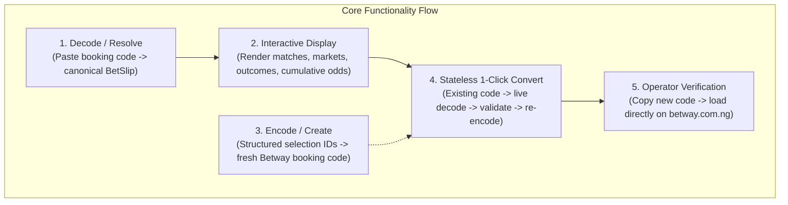

# Betway Nigeria Booking Code Platform

[](https://betway-nigeria-booking-code.vercel.app)
[](https://appdistribution.firebase.google.com/testerapps/1:514619263873:android:01168bcb630c86901bf680/releases/4in8io63t25g8?utm_source=firebase-tools)
[](tests)
[](docs/architecture/02-application-architecture.md)

A production-grade, full-stack web and mobile platform integrating with **Betway Nigeria** (`betway.com.ng`) to decode, generate, and convert sports betting booking codes statelessly across Web and Mobile clients.

Developed for the **Stellar Logic** Product-Minded Full-Stack Engineer technical assessment ([`docs/00-assessment-brief.md`](docs/00-assessment-brief.md), [`docs/06-target-role-and-context.md`](docs/06-target-role-and-context.md)). Given an open brief with full technology freedom, the solution was architected with strategic choices: a unified Next.js 15 Backend-For-Frontend on Vercel, a Clean Architecture Flutter client with BLoC/Cubit, and a 100% stateless conversion design eliminating unnecessary database overhead.

---

## 1. Assessment Deliverables Inventory

All 8 mandatory deliverables specified in [`docs/00-assessment-brief.md`](docs/00-assessment-brief.md) are complete, verified, and linked below:

| # | Required Deliverable | Status | Primary Reference / Artifact Link |
| :-: | :--- | :---: | :--- |
| 1 | **Live Public URL** | **LIVE** | 🌐 [https://betway-nigeria-booking-code.vercel.app](https://betway-nigeria-booking-code.vercel.app) |
| 2 | **Git Repository with Full Commit History** | **COMPLETE** | 🐙 Git history organized into 11 ticket branches merged cleanly into `main` |
| 3 | **Complete Source Code & Documentation** | **COMPLETE** | 📚 [`docs/`](docs/) (Requirements, Findings, Invariants, ADRs, Workflows) |
| 4 | **Mermaid Architecture Diagrams** | **COMPLETE** | 📐 [`docs/architecture/02-application-architecture.md`](docs/architecture/02-application-architecture.md) |
| 5 | **Flutter APK via Firebase App Distribution** | **DISTRIBUTED** | 📲 [Firebase App Tester Portal (Release 4in8io63t25g8)](https://appdistribution.firebase.google.com/testerapps/1:514619263873:android:01168bcb630c86901bf680/releases/4in8io63t25g8?utm_source=firebase-tools) |
| 6 | **iOS IPA Distribution Pathway Note** | **COMPLETE** | 🍏 [`docs/07-ios-ipa-distribution.md`](docs/07-ios-ipa-distribution.md) |
| 7 | **5-Minute Loom Walkthrough Script** | **COMPLETE** | 🎥 [`docs/09-loom-walkthrough-outline.md`](docs/09-loom-walkthrough-outline.md) |
| 8 | **Solution Summary & Engineering Note** | **COMPLETE** | 📝 [`docs/08-solution-summary.md`](docs/08-solution-summary.md) |

---

## 2. Live Deployment Topology & API Gateway

* **Web UI & API Origin**: [https://betway-nigeria-booking-code.vercel.app](https://betway-nigeria-booking-code.vercel.app)
* **Backend API Gateway Base**: `https://betway-nigeria-booking-code.vercel.app/api/v1`
* **Compute Runtime**: Next.js 15 Serverless Route Handlers on Node.js 20+ runtime (Vercel Global Edge Network).
* **Mobile APK Target**: Firebase App Distribution (Project `flutter-dev-395b5`, Release ID `4in8io63t25g8`).

### Backend REST API Endpoints (`/api/v1/*`)

All API routes enforce standardized JSON response envelopes, input validation, upstream error masking, and CORS headers (`INV-03`).

| Method | Endpoint | Description | Example Request |
| :--- | :--- | :--- | :--- |
| `GET` | `/api/v1/health` | Service uptime and health monitoring | `curl -s https://betway-nigeria-booking-code.vercel.app/api/v1/health` |
| `POST` | `/api/v1/resolve` | Decode booking code into canonical `BetSlip` | `curl -X POST https://betway-nigeria-booking-code.vercel.app/api/v1/resolve -H "Content-Type: application/json" -d '{"bookingCode":"BW6D7ABCFB"}'` |
| `POST` | `/api/v1/create` | Generate Betway booking code from selections | `curl -X POST https://betway-nigeria-booking-code.vercel.app/api/v1/create -H "Content-Type: application/json" -d '{"selections":[...]}' ` |
| `POST` | `/api/v1/convert` | Ingest booking code and emit identical new code | `curl -X POST https://betway-nigeria-booking-code.vercel.app/api/v1/convert -H "Content-Type: application/json" -d '{"bookingCode":"BW6D7ABCFB"}'` |
| `OPTIONS` | `/api/v1/*` | CORS preflight handler for cross-origin clients | `curl -i -X OPTIONS https://betway-nigeria-booking-code.vercel.app/api/v1/resolve` |

---

## 3. Core Functional Capabilities



1. **Resolve / Decode (`FR-01`)**: Converts any active Betway Nigeria booking code into a canonical bet slip with event names, markets, selections, individual odds, and cumulative odds.
2. **Interactive Display (`FR-02`)**: Renders structured slips with market tags, status feedback, and quick sample codes in both Web UI (`web/`) and Flutter Mobile View (`mobile/`).
3. **Create / Encode (`FR-03`)**: Encodes structured leg selections into a brand-new valid Betway Nigeria booking code.
4. **Stateless Convert (`FR-04`)**: Composes Resolve and Create into a single-action re-encoder that generates a fresh code for the same bet with 100% data freshness (`INV-05`).
5. **Live Verification Guide (`FR-05`)**: Embedded modal and UI guidance providing 1-click clipboard copy and direct links to `betway.com.ng` for manual round-trip proof.
6. **Flutter Mobile View (`FR-06`)**: Single-screen Flutter mobile application consuming the exact same backend API contract (`INV-03`).

---

## 4. Architecture & Non-Negotiable Invariants

The application follows a **Hexagonal / Clean Architecture** with strict layer separation:

```mermaid
graph TD
    subgraph "Clients Layer"
        WebUI["Web Client (Next.js 15 / React 19 / Tailwind CSS)"]
        FlutterUI["Mobile Client (Flutter 3.x / Dart / BLoC)"]
    end

    subgraph "Application Backend Layer (Vercel Serverless / Node.js 20+ Runtime)"
        APIGateway["Backend Route Handlers (/api/v1/*)"]
        DomainCore["Core Domain & Use Cases (Resolve, Create, Convert)"]
        BetwayAdapter["Betway Integration Gateway (BetwayHttpGateway)"]
        
        APIGateway --> DomainCore
        DomainCore --> BetwayAdapter
    end

    subgraph "External Third-Party Infrastructure"
        BetwayPublicAPI["Betway Nigeria Public API (appsynapse/bet-api-sr02)"]
    end

    WebUI -->|Internal Fetch (Same-Origin)| APIGateway
    FlutterUI -->|HTTPS REST JSON / CORS| APIGateway
    BetwayAdapter -->|Anonymous Outbound HTTPS POST| BetwayPublicAPI
```

### Invariant Checklist
* **`INV-01` (Backend Mediation)**: External Betway endpoints are never called directly by browser or mobile clients; all calls are mediated by `IBetwayGateway` server-side.
* **`INV-02` (Canonical Models)**: Raw Betway DTOs are sanitized and normalized into canonical domain models (`BetSlip`, `BetSelection`).
* **`INV-03` (Uniform Backend API Contract)**: Web UI and Flutter Mobile view consume identical `/api/v1/*` contracts and envelopes.
* **`INV-04` (Stateless Architecture)**: 100% stateless execution with zero database dependencies.
* **`INV-05` (Convert Composition)**: Convert operation composes Resolve and Create primitives rather than duplicating Betway integration logic.
* **`INV-06` (Test Isolation)**: `IBetwayGateway` abstraction enables deterministic offline fixture testing with zero network dependencies.

---

## 5. Repository Structure

```text
/
├── README.md                           # Master project documentation & live links
├── AGENTS.md                           # Multi-agent governance and pipeline rules
├── vercel.json                         # Vercel deployment configuration
├── docs/                               # Source-of-truth documentation
│   ├── 00-assessment-brief.md          # Original assessment brief
│   ├── 01-requirements.md              # Functional & non-functional requirements
│   ├── 02-clarifications.md            # Confirmed architectural decisions
│   ├── 03-betway-integration-findings.md # Forensic Betway endpoint findings
│   ├── 04-scope-and-boundaries.md      # Scope boundaries
│   ├── 05-open-questions-and-risks.md  # Risk register
│   ├── 06-target-role-and-context.md   # Stellar Logic context
│   ├── 07-ios-ipa-distribution.md      # iOS IPA TestFlight & Fastlane guide
│   ├── 08-solution-summary.md          # Comprehensive engineering solution note
│   ├── 09-loom-walkthrough-outline.md  # 5-minute Loom presentation script
│   └── architecture/
│       ├── 01-stack-options.md         # Technology study
│       ├── ADR-0001-stack-selection.md # Accepted stack decision
│       └── 02-application-architecture.md # Primary architecture specification
├── tickets/                            # Ticket lifecycle registry
│   ├── backlog/                        # Pending ticket specs
│   ├── active/                         # Active workstreams
│   └── done/                           # Completed tickets (T011 to T021)
├── research/
│   └── betway/                         # Forensic spike scripts & samples
├── web/                                # Full-Stack Next.js 15 Web Application & Backend API
│   ├── src/
│   │   ├── app/api/v1/                 # Backend Route Handlers (resolve, create, convert, health)
│   │   ├── components/                 # React 19 UI components
│   │   ├── core/                       # Framework-agnostic Domain, Use Cases, Gateway
│   │   └── hooks/                      # React state hooks
│   ├── tests/                          # Vitest unit, integration, and UI test suites
│   ├── package.json
│   └── vercel.json
└── mobile/                             # Flutter Single-Screen Application
    ├── lib/                            # Presentation, Domain, and Infrastructure layers (SOLID/Clean)
    ├── test/                           # Unit, Gateway, Cubit, and Widget test suites
    ├── pubspec.yaml
    └── README.md                       # Mobile APK & Firebase distribution guide
```

---

## 6. Automated Quality Gates & Test Suites

The codebase includes **296 passing automated tests** with 100% offline determinism:

```bash
# ==============================================================================
# Web Quality Gates (215 tests / 27 files, 0 lint errors, 0 type errors, build)
# ==============================================================================
cd web
npm run lint         # ESLint (0 errors, 0 warnings)
npm run typecheck    # TypeScript compiler check (0 errors)
npm run test         # Vitest unit, integration, and component tests (215 passed)
npm run build        # Next.js optimized production build

# ==============================================================================
# Mobile Quality Gates (81 tests, 0 analysis issues, formatted)
# ==============================================================================
cd ../mobile
dart format --output=none --set-exit-if-changed .  # Formatted
flutter analyze      # 0 issues found
flutter test         # 81 unit, cubit, and widget tests passed
```

---

## 7. Delivery Ticket History (`tickets/done/`)

The implementation was delivered across 11 structured tickets, each independently verified by specialized agents against an 8-point Definition of Done:

1. **[`T011`](tickets/done/T011-bootstrap-web-and-core-domain.md)**: Bootstrap Next.js 15 project, canonical domain models (`BetSlip`, `BetSelection`), and `AppError` taxonomy.
2. **[`T012`](tickets/done/T012-implement-betway-gateway.md)**: Implement `IBetwayGateway`, `BetwayHttpGateway` (with 8s timeout and fallback failover), and `MockBetwayGateway`.
3. **[`T013`](tickets/done/T013-implement-application-use-cases.md)**: Implement `ResolveBookingCodeUseCase`, `CreateBookingCodeUseCase`, and `ConvertBookingCodeUseCase`.
4. **[`T014`](tickets/done/T014-implement-backend-api-routes.md)**: Implement `/api/v1/resolve`, `/create`, `/convert`, `/health` Route Handlers with CORS and Zod validation.
5. **[`T015`](tickets/done/T015-implement-web-input-and-slip-view.md)**: Implement interactive Web UI (`BookingCodeInputForm`, `BetSlipCard`, `useBetSlip` hook).
6. **[`T016`](tickets/done/T016-implement-web-conversion-and-verification.md)**: Implement 1-click conversion UI, comparison badges, clipboard toasts, and Betway verification modal.
7. **[`T017`](tickets/done/T017-bootstrap-flutter-gateway-and-di.md)**: Bootstrap Flutter workspace, domain models, `SlipGateway` interface, Retrofit client, and GetIt DI root.
8. **[`T018`](tickets/done/T018-implement-flutter-cubit-and-state.md)**: Implement `SlipCubit` and `SlipState` with comprehensive unit tests.
9. **[`T019`](tickets/done/T019-implement-flutter-slip-viewer-screen.md)**: Implement `SlipViewerScreen` and decomposed Flutter UI widgets.
10. **[`T020`](tickets/done/T020-configure-vercel-deployment.md)**: Configure and verify production Vercel deployment over HTTPS.
11. **[`T021`](tickets/done/T021-build-android-apk-and-firebase-distribution.md)**: Build release Android APK and distribute via Firebase App Distribution.
12. **[`T022`](tickets/active/T022-author-solution-summary-and-loom-prep.md)**: Author solution summary, 5-minute Loom outline, and master delivery index.
