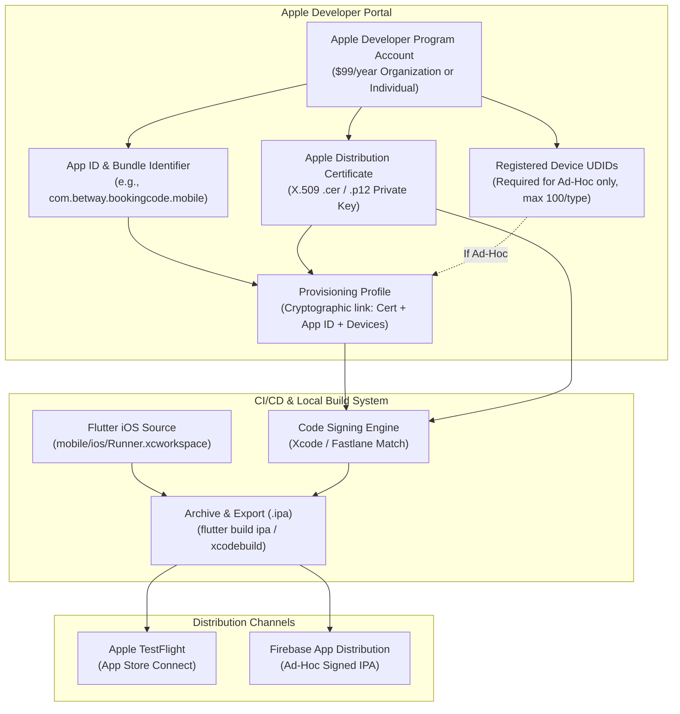
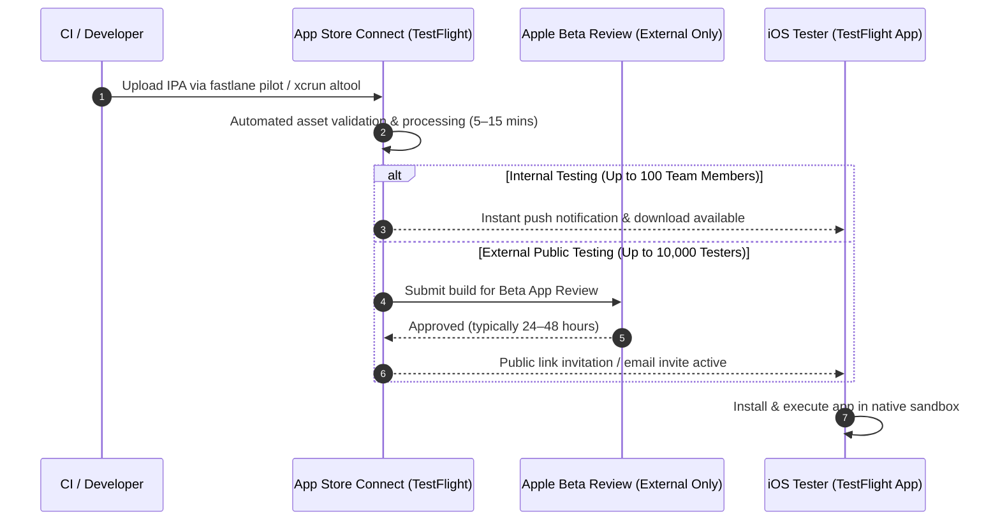

# iOS IPA Distribution Pathway & Architectural Guide

## 1. Executive Summary & Assessment Context

As specified in the technical assessment brief ([`docs/00-assessment-brief.md`](00-assessment-brief.md)) and non-functional requirement `NFR-07` ([`docs/01-requirements.md`](01-requirements.md)), this document provides a comprehensive technical explanation of the **iOS IPA (iOS App Store Package) distribution pathway**.

While Android allows direct compilation and installation of standalone APK binaries (`app-release.apk`) via sideloading (`adb install`) or Firebase App Distribution without device restrictions, Apple's iOS ecosystem enforces a cryptographically sealed sandbox model governed by the Apple Developer Program and mandatory code signing.

This guide details the prerequisites, code signing architecture, build automation, distribution channels (Apple TestFlight vs. Firebase App Distribution), and operational workflows required to distribute the Flutter mobile client to iOS devices.

---

## 2. Fundamental Architectural Differences: Android vs. iOS

| Dimension | Android Distribution (APK) | iOS Distribution (IPA) |
| :--- | :--- | :--- |
| **Package Format** | `.apk` (Android Package) / `.aab` (Android App Bundle) | `.ipa` (iOS App Store Package archive containing `.app` bundle) |
| **Signing Model** | Self-signed keystore (`keytool`) or Google Play App Signing. | X.509 certificates issued exclusively by Apple WWDR Certificate Authority. |
| **Sideloading** | Unrestricted on any device with "Install unknown apps" enabled. | Prohibited by OS security architecture (except tethered debug via Xcode). |
| **Device Targeting** | Any compatible Android device (API Level 21+). | Limited to explicitly registered UDIDs (Ad-Hoc) or managed via TestFlight. |
| **Distribution Platform** | Direct link, ADB, Firebase App Distribution, Google Play. | Apple TestFlight (recommended) or Firebase App Distribution (Ad-Hoc). |
| **Review Gate** | None for internal testing / Firebase. | Beta App Review required for TestFlight external public tester groups. |

---

## 3. Apple Developer Ecosystem Prerequisites

To compile, sign, and distribute an iOS IPA, the following assets and accounts are required:



### 3.1 Account & Identity Assets
1. **Apple Developer Program Membership**: Active paid account ($99/year).
2. **Team ID & Organization**: 10-character alphanumeric identifier associated with the developer team.
3. **App ID (Bundle Identifier)**: Explicit identifier matching the Flutter bundle ID (e.g. `com.betway.bookingcode.mobile` configured in `ios/Runner.xcodeproj/project.pbxproj`).
4. **Distribution Certificate**: Generated from a Certificate Signing Request (CSR) created on macOS Keychain Access or via Fastlane Match.
5. **Provisioning Profile**:
   * **App Store / TestFlight Profile**: Wildcard/unlimited device authorization for App Store and TestFlight distribution.
   * **Ad-Hoc Profile**: Contains a whitelist of specific Device Identifiers (UDIDs) for external ad-hoc distribution (e.g. via Firebase).

---

## 4. Code Signing & Provisioning Architecture

Apple code signing guarantees binary integrity and verifies the publisher identity. An iOS `.ipa` payload cannot be executed on non-jailbroken hardware without a valid provisioning profile embedded inside `Runner.app/embedded.mobileprovision`.

### 4.1 Automated Certificate Management with Fastlane `match`
In a professional CI/CD environment, manual certificate exchange is replaced by Fastlane `match`, which implements the Git-backed centralized certificate management pattern:

```bash
# 1. Initialize match repository (stores encrypted certificates in private Git repo)
fastlane match init

# 2. Generate or fetch App Store / TestFlight certificates and profiles
fastlane match appstore --app_identifier "com.betway.bookingcode.mobile"

# 3. Generate or fetch Ad-Hoc certificates for Firebase distribution
fastlane match adhoc --app_identifier "com.betway.bookingcode.mobile"
```

---

## 5. Build and Packaging Pipeline

### 5.1 Flutter CLI Build Command
To produce an unsigned or release-ready archive directly from Flutter:

```bash
cd mobile

# Build iOS archive with production backend configuration
flutter build ipa --release \
  --dart-define=API_BASE_URL=https://betway-nigeria-booking-code.vercel.app \
  --export-options-plist=ios/ExportOptions.plist
```

### 5.2 Command-Line Archive & Export (`xcodebuild`)
For deterministic CI/CD builds on macOS runners (GitHub Actions, Bitrise, Xcode Cloud):

```bash
# Step 1: Install CocoaPods dependencies
cd mobile/ios && pod install && cd ..

# Step 2: Archive the Xcode Workspace
xcodebuild -workspace ios/Runner.xcworkspace \
  -scheme Runner \
  -configuration Release \
  -archivePath build/ios/archive/Runner.xcarchive \
  -destination 'generic/platform=iOS' \
  archive

# Step 3: Export the IPA using ExportOptions.plist
xcodebuild -exportArchive \
  -archivePath build/ios/archive/Runner.xcarchive \
  -exportOptionsPlist ios/ExportOptions.plist \
  -exportPath build/ios/ipa
```

### 5.3 Sample `ExportOptions.plist`

#### For App Store / TestFlight:
```xml
<?xml version="1.0" encoding="UTF-8"?>
<!DOCTYPE plist PUBLIC "-//Apple//DTD PLIST 1.0//EN" "http://www.apple.com/DTDs/PropertyList-1.0.dtd">
<plist version="1.0">
<dict>
    <key>method</key>
    <string>app-store</string>
    <key>teamID</key>
    <string>YOUR_TEAM_ID</string>
    <key>uploadBitcode</key>
    <false/>
    <key>compileBitcode</key>
    <false/>
    <key>uploadSymbols</key>
    <true/>
    <key>signingStyle</key>
    <string>manual</string>
    <key>provisioningProfiles</key>
    <dict>
        <key>com.betway.bookingcode.mobile</key>
        <string>Betway Booking Code AppStore Profile</string>
    </dict>
</dict>
</plist>
```

#### For Ad-Hoc / Firebase App Distribution:
```xml
<?xml version="1.0" encoding="UTF-8"?>
<!DOCTYPE plist PUBLIC "-//Apple//DTD PLIST 1.0//EN" "http://www.apple.com/DTDs/PropertyList-1.0.dtd">
<plist version="1.0">
<dict>
    <key>method</key>
    <string>ad-hoc</string>
    <key>teamID</key>
    <string>YOUR_TEAM_ID</string>
    <key>signingStyle</key>
    <string>manual</string>
    <key>provisioningProfiles</key>
    <dict>
        <key>com.betway.bookingcode.mobile</key>
        <string>Betway Booking Code AdHoc Profile</string>
    </dict>
</dict>
</plist>
```

---

## 6. Distribution Pathways for iOS

### Pathway A: Apple TestFlight (Industry Standard & Recommended)

TestFlight is Apple's native beta distribution service integrated into App Store Connect. It is the gold standard for iOS distribution because it eliminates the need to collect individual device UDIDs.



#### TestFlight Deployment Commands:
```bash
# Upload via Fastlane Pilot
fastlane pilot upload \
  --ipa "build/ios/ipa/Runner.ipa" \
  --api_key_path "fastlane/app_store_connect_key.json" \
  --groups "Internal Testers, QA Engineers" \
  --changelog "Release build pointing to live Vercel backend"
```

---

### Pathway B: Firebase App Distribution for iOS (Ad-Hoc Signing)

Firebase App Distribution can deliver iOS IPAs, but it requires an **Ad-Hoc Provisioning Profile** containing the UDID of every tester device.

#### Tester Onboarding Lifecycle with Firebase iOS:
1. **Invite Tester**: Developer invites tester via Firebase Console or CLI.
2. **Tester Device Registration**: Tester opens the Firebase invitation email on their iPhone/iPad and installs the Firebase profile to register their device's Unique Device Identifier (UDID).
3. **UDID Export**: Firebase notifies the developer of newly registered UDIDs.
4. **Provisioning Profile Update**: Developer downloads the UDID list, adds them to the Apple Developer Portal under **Devices**, regenerates the Ad-Hoc Provisioning Profile, and re-signs the build.
5. **Re-upload Build**: Re-compiled IPA is uploaded to Firebase App Distribution.
6. **Installation**: Tester downloads and installs the updated IPA directly from the Firebase App Tester web interface.

#### Firebase CLI Upload Command:
```bash
firebase appdistribution:distribute build/ios/ipa/Runner.ipa \
  --app 1:1234567890:ios:abcdef123456 \
  --groups "qa-team, stakeholders" \
  --release-notes "iOS Ad-Hoc release candidate build"
```

---

## 7. Comparative Analysis: TestFlight vs. Firebase App Distribution for iOS

| Feature / Criteria | Apple TestFlight | Firebase App Distribution (Ad-Hoc) |
| :--- | :--- | :--- |
| **Setup Complexity** | Low (Single App Store profile) | High (Requires ongoing UDID maintenance) |
| **Tester Onboarding** | Tap public link or accept email | Multi-step configuration profile download |
| **Device Registration** | Zero UDID registration required | Up to 100 devices per year limit |
| **Turnaround Time** | Instant for internal; 24h for external | Instant once UDIDs are included in profile |
| **Crash Reporting & Logs** | Native Xcode CrashOrganizer | Firebase Crashlytics SDK integration |
| **Recommended Use** | **Primary iOS distribution channel** | Supplementary when TestFlight review is blocked |

---

## 8. Summary of Steps to Enable iOS Distribution

If the project is extended to produce live iOS builds in the future:
1. Enroll the organization in the **Apple Developer Program**.
2. Register App ID `com.betway.bookingcode.mobile` with associated capabilities.
3. Configure iOS project scheme signing settings in `mobile/ios/Runner.xcodeproj`.
4. Run `cd mobile && flutter build ipa --release --dart-define=API_BASE_URL=https://betway-nigeria-booking-code.vercel.app`.
5. Upload the resulting `.ipa` to App Store Connect / TestFlight via Fastlane or Transporter CLI.
6. Distribute test invitations via TestFlight internal and external test groups.
