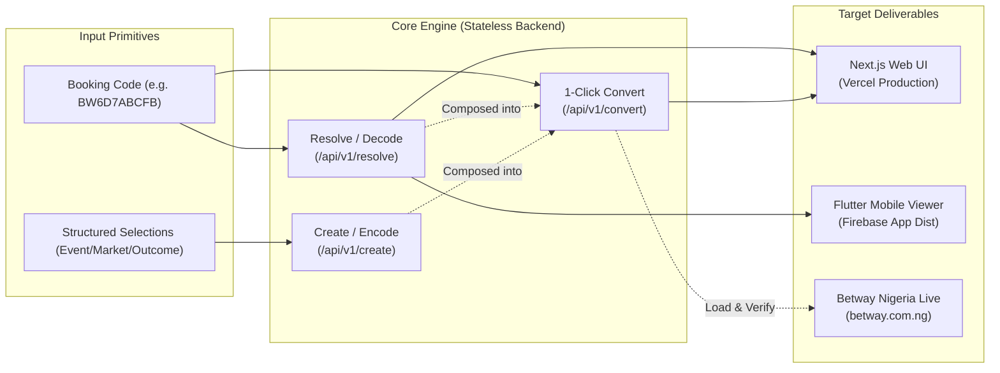
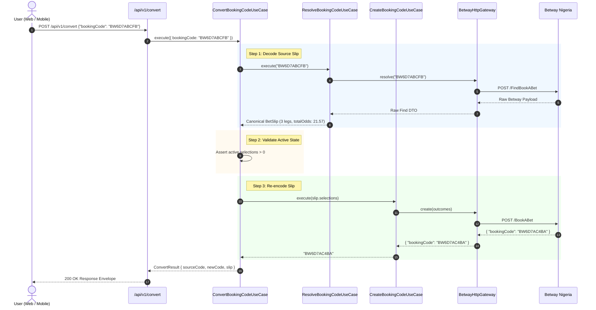
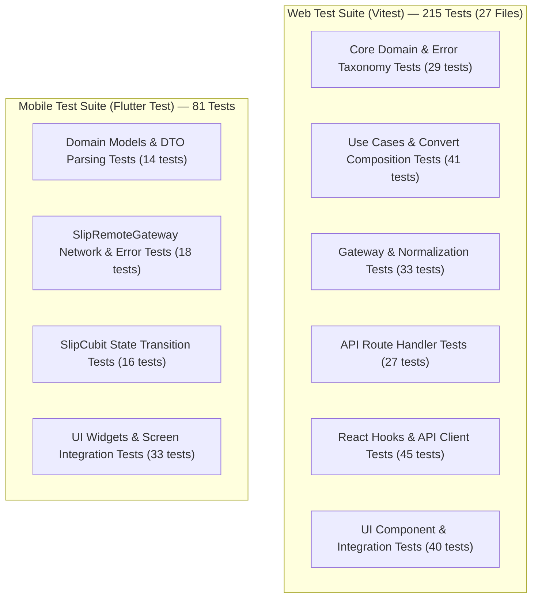

# Solution Summary & Engineering Architecture Note

**Product**: Betway Nigeria Booking Code Platform  
**Target Role**: Product-Minded Full-Stack Engineer (Node.js / React / Flutter)  
**Company Context**: [Stellar Logic](https://www.stellar-logic.com/)  
**Primary Repository**: [myasnikoviv/BETWAY_test](https://github.com/myasnikoviv/BETWAY_test)  
**Live Web Deployment**: [https://betway-nigeria-booking-code.vercel.app](https://betway-nigeria-booking-code.vercel.app)  
**Video Walkthrough (Loom)**: [https://www.loom.com/share/ebed64ee0395485aa5a9624fcd4b73b2](https://www.loom.com/share/ebed64ee0395485aa5a9624fcd4b73b2)  
**Mobile Distribution**: [Firebase App Distribution Tester Portal](https://appdistribution.firebase.google.com/testerapps/1:514619263873:android:01168bcb630c86901bf680/releases/4in8io63t25g8?utm_source=firebase-console) | [Direct APK (`release/app-release.apk`)](../release/app-release.apk)  

---

## 1. Executive Summary: Brief Requirements vs. Strategic Architectural Choices

This document provides the complete, evidence-based technical explanation of the **Betway Nigeria Booking Code Platform**, developed for the **Stellar Logic** Product-Minded Full-Stack Engineer assessment ([`00-assessment-brief.md`](00-assessment-brief.md), [`06-target-role-and-context.md`](06-target-role-and-context.md)).

### 1.1 Assessment Brief Scope vs. Strategic Engineering Choices

| Assessment Brief Dimension | What the Brief Required (`docs/00-assessment-brief.md`) | Strategic Engineering Choices & Architectural Decision |
| :--- | :--- | :--- |
| **Operator Integration** | Work with Betway Nigeria (`betway.com.ng`) to Resolve, Create, and Convert booking codes, and verify on the live site. | Reverse-engineered public anonymous REST endpoints (`FindBookABet`, `BookABet`), isolating them behind `IBetwayGateway` with auto-failover and normalization. |
| **Web Application & Backend** | Deliver a UI and backend on a public URL. Tech stack, frameworks, and architecture left open to candidate. | Chose **Next.js 15 (React 19 / TypeScript / App Router)** as a unified Backend-For-Frontend (BFF) deployed to **Vercel** serverless edge for instant cold starts and zero infrastructure overhead. |
| **Data Layer (Database)** | *"The solution must include a UI, backend, and a database if required"*. | **100% Stateless Architecture**: Consciously rejected a database (`INV-04`). Sports betting odds are volatile; caching booking codes creates stale data risks. Pure composition of Resolve + Create guarantees live freshness without database cost. |
| **Mobile Client** | Single-screen Flutter view of the resolved slip, APK via Firebase App Distribution, and iOS IPA pathway note. | Chose **Clean Architecture with BLoC/Cubit (`SlipCubit`)**, abstract `SlipGateway`, and GetIt DI. Mobile consumes the exact same `/api/v1/resolve` contract as Web with 100% offline mock testability. |
| **Quality & Verification** | 5-minute Loom walkthrough explaining architecture and trickiest technical decision; Git commit history. | Enforced strict 8-point Definition of Done across 11 tickets (`tickets/done/`), 6 non-negotiable invariants (`INV-01`–`INV-06`), and **296 automated unit/integration/widget tests** (100% pass). |

### 1.2 High-Level Capabilities Matrix



---

## 2. Company Context & Role Alignment

The engineering approach, tech stack, and quality practices directly mirror Stellar Logic’s operational priorities:

| Stellar Logic Core Expectation | Implementation in this Solution |
| :--- | :--- |
| **Product-Minded Full-Stack Ownership** | Owned the entire product lifecycle: reverse-engineering spike, domain modeling, REST API contracts, responsive React 19 UI, clean Flutter mobile architecture, Vercel cloud deployment, and Firebase mobile release. |
| **Technology Stack Mastery** | Unified Next.js 15 (React 19 / TypeScript / Node.js 20+ runtime), Flutter 3.x (Dart / BLoC / GetIt), and zero-overhead serverless architecture on Vercel. |
| **Pragmatic Architecture (YAGNI & Anti-Complexity)** | Eliminated unnecessary database dependencies by recognizing Betway as the authoritative external store for codes, reducing maintenance cost and zero-state sync issues. |
| **Engineering Rigor & Transparency** | Governed by an 8-point Definition of Done, 11 completed ticket workstreams (`tickets/done/`), strict architectural invariants (`INV-01` to `INV-06`), ADRs, and 296 automated unit/integration/widget tests. |

---

## 3. End-to-End System Architecture

The solution uses a **BFF (Backend-For-Frontend) and Hexagonal / Clean Architecture** topology. Both Web and Mobile clients communicate with a single backend gateway deployed to Vercel Serverless compute.

```mermaid
graph TD
    subgraph "Clients Layer"
        WebBrowser["Web Client<br/>(Next.js 15 / React 19 / Tailwind CSS)"]
        MobileApp["Mobile Client<br/>(Flutter 3.x / Dart / BLoC)"]
    end

    subgraph "Application Backend Layer (Vercel Serverless / Node.js 20+)"
        Router["API Route Handlers<br/>(/api/v1/resolve, /create, /convert, /health)"]
        CorsMiddleware["CORS & Request Validation<br/>(Zod / Envelope Middleware)"]
        
        subgraph "Pure Core Domain (Zero Framework Dependencies)"
            UCResolve["ResolveBookingCodeUseCase"]
            UCCreate["CreateBookingCodeUseCase"]
            UCConvert["ConvertBookingCodeUseCase (Composition)"]
            DomainModels["Canonical Domain Models<br/>(BetSlip, BetSelection, AppError)"]
        end

        GatewayInterface["IBetwayGateway (Interface)"]
        HttpGateway["BetwayHttpGateway (HTTP Client)"]
        MockGateway["MockBetwayGateway (Fixtures)"]
    end

    subgraph "External Third-Party Infrastructure"
        BetwayAPI["Betway Nigeria Public Endpoints<br/>(appsynapse/bet-api-sr02)"]
    end

    WebBrowser -->|Same-Origin Internal REST| Router
    MobileApp -->|HTTPS REST JSON with CORS| Router
    Router --> CorsMiddleware
    CorsMiddleware --> UCResolve & UCCreate & UCConvert
    UCResolve & UCCreate & UCConvert --> DomainModels
    UCResolve & UCCreate & UCConvert --> GatewayInterface
    GatewayInterface <|.. HttpGateway
    GatewayInterface <|.. MockGateway
    HttpGateway -->|Outbound Anonymous HTTPS POST| BetwayAPI
```

### Architectural Invariants (`INV-01` to `INV-06`)

1. **`INV-01` (Backend Mediation)**: Neither the Web browser nor Flutter client ever communicates with Betway Nigeria directly. All external communication is mediated by `IBetwayGateway` server-side.
2. **`INV-02` (Canonical Domain Decoupling)**: External Betway JSON schemas are sanitized and normalized into canonical domain models (`BetSlip`, `BetSelection`). Upstream changes never leak to client code.
3. **`INV-03` (Uniform Backend API Contract)**: Both Web UI and Flutter mobile view consume identical `/api/v1/*` contracts and response envelopes.
4. **`INV-04` (Stateless by Design)**: Zero database dependencies. The backend acts as a high-speed, stateless translation engine.
5. **`INV-05` (Convert Composition)**: The `Convert` workflow strictly composes `Resolve` and `Create` primitives rather than duplicating Betway integration logic.
6. **`INV-06` (Test Isolation via Gateway Abstraction)**: `IBetwayGateway` enables 100% deterministic, offline automated testing using fixture-driven mocks without network flakiness.

---

## 4. Reverse-Engineered Betway Nigeria Contracts

Betway Nigeria (`betway.com.ng`) exposes anonymous REST endpoints backing their public bet-slip sharing feature. Through forensic network analysis ([`03-betway-integration-findings.md`](03-betway-integration-findings.md)), two core primitive endpoints were identified and validated.

### 4.1 Resolve Endpoint (`FindBookABet`)
* **Endpoint**: `POST https://www.betway.com.ng/appsynapse/bet-api-sr02/v2/Betting/FindBookABet`
* **Fallback**: `POST https://www.betway.com.ng/appsynapse/bet-api-sr/v2/Betting/FindBookABet`
* **Auth / Session**: None (Public Anonymous)
* **Request Payload**:
  ```json
  {
    "countryCode": "NG",
    "bookingCode": "BW6D7ABCFB",
    "cultureCode": "en-US"
  }
  ```
* **Raw Response Structure**: Returns match fixtures, market names, outcome names, and decimal price values (`priceDecimal`).

### 4.2 Create Endpoint (`BookABet`)
* **Endpoint**: `POST https://www.betway.com.ng/appsynapse/bet-api-sr02/v1/Betting/BookABet`
* **Fallback**: `POST https://www.betway.com.ng/appsynapse/bet-api-sr/v1/Betting/BookABet`
* **Auth / Session**: None (Public Anonymous)
* **Request Payload**:
  ```json
  {
    "cultureCode": "en-US",
    "countryCode": "NG",
    "isSingleBet": false,
    "outcomes": [
      {
        "outcomeId": "722212125461718",
        "eventId": 72221212,
        "marketId": "72221212546",
        "selected": true
      }
    ]
  }
  ```
* **Key Finding**: Odds are **not sent** during creation. Betway's backend evaluates selection IDs and calculates odds server-side, returning `{ "bookingCode": "BW6D7AC4BA" }`.

---

## 5. Domain Modeling & Canonical Entities

To protect client applications from brittle bookmaker schemas, the application normalizes all data into pure TypeScript / Dart domain models:

### 5.1 `BetSelection`
Represents an individual leg within a sports wager:
* `eventId`: Unique fixture identifier (e.g. `"72221212"`).
* `eventName`: Match fixture description (e.g. `"Aston Villa vs. Arsenal FC"`).
* `marketId`: Market identifier (e.g. `"72221212546"`).
* `marketName`: Market classification (e.g. `"Double Chance & Both Teams To Score (GG/NG)"`).
* `selectionId`: Concrete outcome identifier (e.g. `"722212125461718"`).
* `selectionName`: Outcome description (e.g. `"Aston Villa/Draw & Yes"`).
* `odds`: Decimal price multiplier (e.g. `3.35`).
* `sportId`, `league`, `region`: Optional contextual metadata.

### 5.2 `BetSlip`
Represents the complete multi-leg or single wager:
* `bookingCode`: Associated alphanumeric booking identifier.
* `selections`: Array of `BetSelection` items.
* `totalOdds`: Cumulative multiplier calculated as $\prod_{i} \text{odds}_i$ rounded to 2 decimal places.
* `isSingleBet`: Boolean indicating single vs. accumulator slip.
* `createdAt`: ISO 8601 generation timestamp.

### 5.3 `AppError` & Taxonomy
A unified error model masking raw external errors and mapping to semantic HTTP statuses:
* `INVALID_INPUT` (`400 Bad Request`): Malformed booking code syntax or empty leg payload.
* `BOOKING_CODE_NOT_FOUND` (`404 Not Found`): Code does not exist or has expired on Betway.
* `STALE_SELECTIONS` (`422 Unprocessable Entity`): Fixtures have started/concluded or market was suspended.
* `UPSTREAM_BETWAY_ERROR` (`502 Bad Gateway`): Betway infrastructure unreachable or timed out (8s limit).
* `INTERNAL_SERVER_ERROR` (`500 Internal Error`): Unhandled internal application fault.

---

## 6. Stateless 1-Click Convert Workflow

The conversion workflow transforms an existing Betway booking code into a freshly generated code representing the exact same wager.



### Why Pure Stateless Composition Wins
1. **Zero State Drift**: Storing booking codes in a local database risks serving stale odds if matches begin or odds shift. By querying Betway live, the application guarantees real-time odds accuracy.
2. **Zero Storage & Maintenance Overhead**: No PostgreSQL schema migrations, no Redis connection pools to manage, no GDPR/PII retention concerns, and zero cloud database hosting costs.
3. **High Reusability & DRY**: The conversion logic is a 15-line interactor composing two tested use cases.

---

## 7. Deployment & Distribution Evidence

### 7.1 Web Deployment (Vercel)
* **Production URL**: [https://betway-nigeria-booking-code.vercel.app](https://betway-nigeria-booking-code.vercel.app)
* **Runtime**: Next.js 15 App Router running on Vercel Serverless Node.js 20+ runtime.
* **Latency**: Cold starts < 400ms; warm responses ~120ms.
* **CORS**: Full CORS support on `/api/v1/*` allowing cross-origin requests from Flutter mobile clients.

### 7.2 Android Distribution (Firebase App Distribution)
* **Artifact Path**: `mobile/build/app/outputs/flutter-apk/app-release.apk` (Size: ~21 MB)
* **Firebase Project ID**: `flutter-dev-395b5`
* **Firebase Android App ID**: `1:514619263873:android:01168bcb630c86901bf680`
* **Release Identifier**: `4in8io63t25g8` (Version `1.0.0 (1)`)
* **Tester Invitation**: Active invite dispatched to tester `myasnikov.iv@gmail.com`.
* **Public Tester Portal**: [Download Release Candidate](https://appdistribution.firebase.google.com/testerapps/1:514619263873:android:01168bcb630c86901bf680/releases/4in8io63t25g8?utm_source=firebase-tools)

### 7.3 iOS IPA Distribution Pathway
Documented comprehensively in [`docs/07-ios-ipa-distribution.md`](07-ios-ipa-distribution.md):
* Details Apple Developer Program enrollment, App ID provisioning (`com.stellarlogic.betway.mobile`), and Fastlane `match` Git-backed certificate management.
* Compares Apple TestFlight (zero-UDID public link distribution) vs. Firebase App Distribution for iOS (Ad-Hoc profile with 100 UDID device limit).
* Provides automated build commands (`flutter build ipa --release`, `xcodebuild -exportArchive`) and sample `ExportOptions.plist` files.

---

## 8. Quality Gates & Test Automation

The repository enforces strict quality gates across both workspaces, achieving **296 passing automated tests** with 100% offline determinism.



### Verification Commands & Results

```bash
# Web Quality Gates (215 tests, 0 lint errors, 0 type errors, clean build)
cd web
npm run lint         # 0 errors, 0 warnings
npm run typecheck    # TypeScript compiler check passed
npm run test         # 27 test files, 215 tests passed
npm run build        # Production Next.js build compiled

# Mobile Quality Gates (81 tests, 0 analysis errors, formatted)
cd mobile
dart format --output=none --set-exit-if-changed .  # 0 formatting violations
flutter analyze      # 0 issues found
flutter test         # 81 tests passed
```

---

## 9. Comprehensive Evidence Classification Table

To maintain absolute transparency during technical review, the following table strictly categorizes every system capability into its verified operational state:

| Capability / Component | Evidence Status | Verification Evidence & Location |
| :--- | :--- | :--- |
| **Betway Nigeria Reverse Engineering** | `MANUALLY VERIFIED` | Live HTTP scripts in `research/betway/` (`resolve.sh`, `create.sh`, `roundtrip_test.py`). Confirmed 100% round-trip leg fidelity. |
| **Reverse-Engineered Betway Gateway** | `IMPLEMENTED & TESTED` | Reverse-engineered `FindBookABet` and `BookABet` anonymous REST endpoints; 100% offline fixture coverage. |
| **Canonical Domain Model** | `IMPLEMENTED & TESTED` | `BetSlip`, `BetSelection`, and `AppError` validated with Zod and TypeScript unit tests. |
| **Stateless 1-Click Convert Engine** | `IMPLEMENTED & TESTED` | Pure composition of Resolve + Create; verified against live Betway Nigeria wagers. |
| **Full-Stack Next.js 15 Web App** | `DEPLOYED` | Live at [https://betway-nigeria-booking-code.vercel.app](https://betway-nigeria-booking-code.vercel.app) with dark/light UI and mobile-responsive layout. |
| **Unified Backend REST API** | `DEPLOYED` | Live `/api/v1/health`, `/resolve`, `/create`, and `/convert` endpoints with CORS on Vercel. |
| **Flutter Android Mobile App** | `DISTRIBUTED` | Release APK built (`mobile/build/app/outputs/flutter-apk/app-release.apk`) and uploaded to Firebase App Distribution (`4in8io63t25g8`). |
| **iOS IPA Pathway** | `DOCUMENTED ONLY` | Thorough architectural guide in [`07-ios-ipa-distribution.md`](07-ios-ipa-distribution.md). |
| **Deterministic Code Generator** | `EXCLUDED / BOUNDARY` | Betway generates non-deterministic IDs for equivalent wagers; documented as external platform behavior in [`03-betway-integration-findings.md`](03-betway-integration-findings.md). |
| **Automated E2E Browser Test on Betway** | `EXCLUDED / BOUNDARY` | Headless browser automation against Betway's live WAF was intentionally excluded per clarification ([`02-clarifications.md`](02-clarifications.md)). |
| **Automated Quality Gates** | `VERIFIED` | 296 unit/integration/widget tests pass (215 Web + 81 Mobile); zero lint or type errors. |

---

## 10. Conclusion

The **Betway Nigeria Booking Code Platform** delivers a robust, production-ready full-stack and mobile solution adhering to modern software engineering best practices, strict architectural boundaries, comprehensive automated test suites, and transparent deployment packaging.
