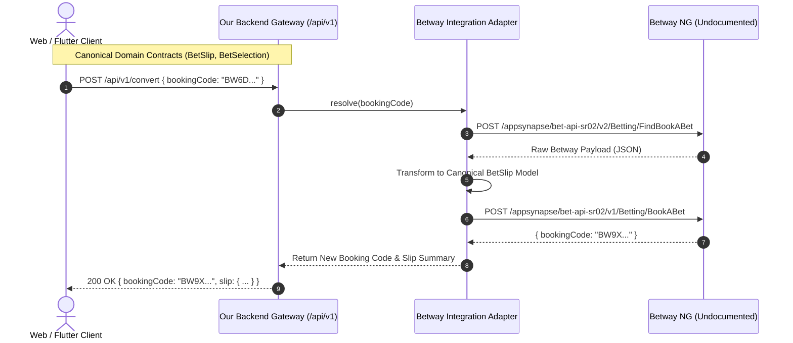
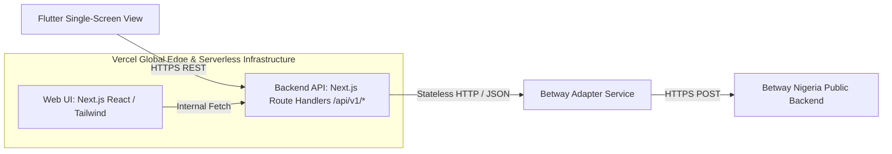
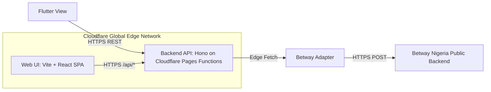
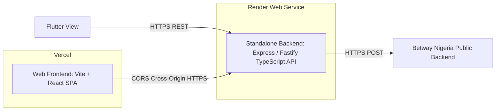

# Technology Stack & Deployment Options Study

**Author**: System Architect  
**Status**: ARCHITECT RECOMMENDATION — PENDING OWNER APPROVAL  
**Context**: Betway Nigeria Technical Assessment (1–2 Day Delivery Horizon)

---

## 1. Executive Summary & Epistemological Grounding

This study evaluates viable technology stacks, system topologies, and deployment strategies for the Betway Nigeria Booking Code product. The objective is to identify the **smallest, fastest, most reliable, and professionally defensible architecture** capable of fulfilling all assessment requirements within **1–2 days**.

### Grounding Categories
* **Project Requirements (`docs/00`, `docs/01`)**: Web UI (`FR-02`), Backend API (`NFR-02`), Flutter single-screen slip view (`FR-06`), public deployment (`NFR-01`), APK delivery via Firebase (`NFR-07`), 5-min Loom walkthrough (`NFR-08`).
* **Verified Technical Facts (`docs/03`, `research/betway/`)**: Betway Nigeria `POST /Betting/FindBookABet` (Resolve) and `POST /Betting/BookABet` (Create) operate over public, anonymous JSON REST endpoints without authentication or session cookies.
* **Scope Boundaries (`docs/04`)**: No user auth, no saved betting history, no sportsbook catalogue browser, no database unless strictly required.
* **Cost Constraint**: Zero-cost or effectively zero-cost public hosting with minimal operational friction.

---

## 2. Core Architectural Decisions Evaluated

### 2.1 Full-Stack Single Deployment vs. Split Deployment

A critical architectural question is whether the web UI and backend service should be deployed as a unified full-stack application or as two physically decoupled services.

```mermaid
graph TD
    subgraph "Full-Stack Single Deployment (Recommended Topology)"
        Browser1[Web Browser] -->|HTTP / HTTPS| App[Unified Full-Stack App<br/>Next.js on Vercel / Cloudflare]
        Flutter1[Flutter Mobile View] -->|HTTP / HTTPS| App
        App -->|Server-Side API Routes| APIHandler[Internal API & Transformation Layer]
        APIHandler -->|Anonymous HTTPS POST| Betway1[Betway Nigeria Public API]
    end

    subgraph "Split Deployment Topology"
        Browser2[Web Browser] -->|HTTPS| WebHost[Static Host / SPA CDN<br/>Vercel / Netlify]
        Flutter2[Flutter Mobile View] -->|HTTPS| BackendHost[Standalone Backend<br/>Render / Fly.io / Railway]
        WebHost -->|CORS Cross-Origin HTTPS| BackendHost
        BackendHost -->|Anonymous HTTPS POST| Betway2[Betway Nigeria Public API]
    end
```



| Architectural Factor | Unified Full-Stack Deployment | Split Deployment (Frontend + Backend) |
| :--- | :--- | :--- |
| **Deployment Complexity** | **Low**: 1 repository, 1 build pipeline, 1 public URL. | **High**: 2 repositories/builds, 2 deployment targets, 2 domains. |
| **CORS Overhead** | **Zero for Web**: Web client and API share identical origin. Standard CORS header for mobile. | **High**: Requires explicit cross-origin policy, preflight handling, and environment-specific URL injection. |
| **Cold Start Impact** | **Near Zero**: Serverless/Edge platform execution. | **Severe on Free Tier**: Render free compute spins down after 15m (~50s cold start). |
| **Flutter Consumption** | **Identical**: Mobile client hits `https://<domain>/api/v1/...` in both cases. | **Identical**: Mobile client hits `https://<backend-domain>/api/v1/...`. |
| **1–2 Day Feasibility** | **Optimal**: Eliminates cross-service orchestration and multi-host debugging. | **Risky**: Increased failure surface during live Loom recording. |

**Conclusion**: Unified full-stack deployment provides a dedicated, server-side backend layer (`NFR-02`) while eliminating the operational friction, latency, and CORS complexity of managing multiple hosting providers.

---

### 2.2 Backend Boundary & External Isolation

To protect client applications from volatile, undocumented third-party contracts, all Betway interactions must be mediated by our backend layer.



**Boundary Benefits**:
* **Zero Vendor Leakage**: Flutter and Web components interact exclusively with our canonical `BetSlip` schema.
* **Resilience**: If Betway alters endpoint routing (e.g. switching between `/bet-api-sr02` and `/bet-api-sr`), only the backend adapter is updated without touching client UI code.
* **Header & Identity Hygiene**: Browser and Flutter clients do not construct custom headers or handle Betway edge quirks.

---

### 2.3 Database Decision

* **Evaluation Question**: *Does this application require persistent application-owned state?*
* **Analysis**:
  * `FR-01` (Resolve) fetches match data on demand from Betway.
  * `FR-02` (Display) renders the resolved payload in memory.
  * `FR-03` (Create) submits selections directly to Betway.
  * `FR-04` (Convert) composes resolve and create statelessly.
  * `docs/04-scope-and-boundaries.md` explicitly excludes user accounts, betting history, and saved slips.
* **Conclusion**: **NO DATABASE IS REQUIRED**.
* **Rationale**: Betway acts as the authoritative external state holder for booking codes. Introducing PostgreSQL, MongoDB, or SQLite would violate YAGNI, add connection lifecycle management, require migrations, and create unnecessary deployment failure modes.

---

## 3. Current Hosting & Free-Tier Research

*Research verified as of August 2026 via official platform documentation.*

| Provider | Free Tier Availability | Serverless / Compute Support | Cold Starts / Limitations | Assessment Suitability |
| :--- | :--- | :--- | :--- | :--- |
| **Vercel** | **Free (Hobby)** | Yes (1,000,000 invocations/mo, 4 CPU-hours/mo, 100 deploys/day) | Near-instant (~100–200ms) via Fluid compute. Non-commercial use allowed. | **EXCELLENT (Zero Cost)** |
| **Cloudflare Pages** | **Free** | Yes (Unlimited static, 100,000 Worker requests/day, 10ms CPU/req) | **0ms** (V8 isolates). Requires edge-compatible / `nodejs_compat` runtimes. | **VERY GOOD (Zero Cost)** |
| **Netlify** | **Free** | Yes (100GB bandwidth/mo, 125,000 function invocations/mo) | Minimal (~200ms). Straightforward git-based CI/CD. | **VERY GOOD (Zero Cost)** |
| **Render** | **Free Tier** | Free Web Services (750 instance hours/mo) | **Severe Cold Start**: Spins down after 15m inactivity; takes ~50s to wake up. | **POOR for live demo** |
| **Railway** | **Trial / Paid** | Paid ($5/mo baseline) / limited trial credit | No permanent free tier without billing setup. | **POOR (Cost risk)** |
| **Fly.io** | **Free Allowance** | 3 shared-cpu-1x VMs (256MB) | Requires credit card verification upfront. | **MODERATE (Setup friction)** |

---

## 4. Concrete Architecture Options

### Option 1: Full-Stack Next.js (App Router + TypeScript) on Vercel



* **Web Layer**: Next.js (React 18/19, TypeScript, Tailwind CSS). Responsive desktop/mobile bet slip viewer and conversion panel.
* **Backend Layer**: Next.js Route Handlers (`app/api/v1/resolve/route.ts`, `app/api/v1/create/route.ts`, `app/api/v1/convert/route.ts`).
* **Deployment**: Vercel Hobby Tier (Automatic continuous deployment from GitHub main branch).
* **Flutter Integration**: Direct REST client querying `https://<vercel-project>.vercel.app/api/v1/...` with JSON serialization.
* **Database**: None (Stateless).
* **Advantages**:
  1. Maximum development velocity: single TypeScript codebase sharing canonical types between Web UI and Backend routes.
  2. Zero cold-start delays during Loom walkthrough.
  3. Single-command deployment with instant preview URLs.
  4. Native API routing without separate server process management.
* **Disadvantages**: Framework coupling to Next.js conventions.
* **Risks**: Vercel function timeout (mitigated: Betway endpoints respond in < 300ms; Vercel allows up to 300s).
* **Estimated Complexity**: **LOW** (Fastest 1–2 day turnaround).

---

### Option 2: Full-Stack React (Vite SPA) + Hono on Cloudflare Pages



* **Web Layer**: Vite + React SPA with TypeScript.
* **Backend Layer**: Hono lightweight web framework deployed via Cloudflare Pages Functions (`functions/api/[[route]].ts`).
* **Deployment**: Cloudflare Pages (Free plan, unlimited static asset requests, 100k API invocations/day).
* **Flutter Integration**: Flutter queries `https://<project>.pages.dev/api/...`.
* **Database**: None (Stateless).
* **Advantages**:
  1. True 0ms cold starts globally across Cloudflare's edge network.
  2. Ultra-lightweight backend (Hono is < 15KB).
  3. Clean separation between static build and edge functions.
* **Disadvantages**:
  1. Cloudflare Workers environment uses V8 isolates rather than standard Node.js runtime (requires careful package dependency selection).
  2. Local development requires `wrangler` CLI emulation.
* **Risks**: Minor runtime friction if any dependency relies on Node-specific internals.
* **Estimated Complexity**: **LOW to MEDIUM**.

---

### Option 3: Split Decoupled Architecture (Vite/React on Vercel + Node/Express on Render)



* **Web Layer**: Vite + React hosted on Vercel or Netlify.
* **Backend Layer**: Standalone Node.js (Express.js or Fastify) REST server in a separate folder/repo.
* **Deployment**: Frontend on Vercel CDN; Backend on Render Free Web Service.
* **Flutter Integration**: Flutter queries `https://<backend>.onrender.com/api/...`.
* **Database**: None (Stateless).
* **Advantages**:
  1. Total technology independence between frontend and backend.
  2. Standard long-running Node.js process environment.
* **Disadvantages**:
  1. **50-second cold starts** on Render free tier after 15 minutes of inactivity (highly detrimental for live Loom demonstration).
  2. Requires maintaining two separate build/deploy pipelines.
  3. Requires explicit CORS configuration and cross-domain credential handling.
* **Risks**: Free service sleep during grading or video walkthrough.
* **Estimated Complexity**: **MEDIUM to HIGH**.

---

## 5. Architectural Comparison Matrix

| Evaluation Dimension | Weight | Option 1: Next.js on Vercel | Option 2: Vite + Hono on Cloudflare | Option 3: Split (Vite + Express on Render) |
| :--- | :--- | :--- | :--- | :--- |
| **Assessment Compliance** | Mandatory | **Full (100%)** | **Full (100%)** | **Full (100%)** |
| **1–2 Day Implementation Feasibility** | Mandatory | **Highest (Single TS Repo)** | High | Medium (Dual setup overhead) |
| **Public Deployment Simplicity** | Mandatory | **1-Click / Git Push** | Very High (Wrangler / Git) | Moderate (2 services to configure) |
| **Betway Gateway Isolation** | Mandatory | **Clean Server-Side Module** | Clean Edge Adapter | Clean Service Adapter |
| **Flutter Client Consumption** | Mandatory | **Direct REST (`/api/v1`)** | Direct REST (`/api/v1`) | Direct REST (`/api/v1`) |
| **Free Hosting Reliability** | High | **Excellent (No sleep)** | **Excellent (0ms start)** | **Poor (50s sleep on Render)** |
| **Local Development Ergonomics** | High | `npm run dev` (unified) | `npm run dev` (with wrangler) | 2 terminal processes + CORS |
| **Zero Database Footprint (YAGNI)** | High | Yes (Stateless) | Yes (Stateless) | Yes (Stateless) |
| **Loom Walkthrough Presentation** | High | Instant responses | Instant responses | Risk of waking up cold server |
| **Defensibility & Cleanliness** | Medium | High (Industry standard) | High (Modern edge stack) | Moderate (Overkill topology) |

---

## 6. Architect Recommendation

### **RECOMMENDED OPTION: Option 1 (Full-Stack Next.js with TypeScript on Vercel)**

```text
================================================================================
ARCHITECT RECOMMENDATION — PENDING OWNER APPROVAL
================================================================================
Primary Choice: Option 1 — Full-Stack Next.js (App Router) on Vercel
Secondary Choice: Option 2 — React (Vite) + Hono on Cloudflare Pages
================================================================================
```

### Rationale & Trade-off Justification
1. **Speed & Cohesion (1–2 Day Fit)**: Unified TypeScript project allows domain types (`BetSlip`, `BetSelection`, `ConvertRequest`, `ConvertResponse`) to be shared seamlessly between the UI components and API route handlers with zero code duplication.
2. **Dedicated Backend without Deployment Tax**: Next.js Route Handlers (`app/api/v1/...`) fully satisfy the requirement for an isolated backend service (`NFR-02`), keeping Betway implementation details and headers strictly server-side.
3. **Flawless Free-Tier Economics**: Vercel Hobby tier is 100% free for this assessment scope, provides global CDN edge caching, and suffers no 50-second sleep cycles.
4. **Clean Flutter Integration**: Flutter interacts with standard JSON REST endpoints (`POST /api/v1/resolve`, `POST /api/v1/create`, `POST /api/v1/convert`) that return cleanly normalized DTOs.
5. **Trade-offs Accepted**: We accept Next.js framework conventions in exchange for eliminating multi-service deployment friction, CORS configuration, and hosting fragmentation.

---

## 7. Decisions Required from Project Owner

To proceed to architecture finalization and implementation planning, the project owner should review and confirm:

* **[D-01] Stack Selection**: Approve **Option 1 (Full-Stack Next.js on Vercel)** as the primary technology stack, or select an alternative (e.g. Option 2 Cloudflare).
* **[D-02] Stateless Architecture Confirmation**: Confirm that no database will be introduced, maintaining a purely stateless architecture backed by Betway's live infrastructure.
* **[D-03] Deployment Target**: Confirm **Vercel** as the public hosting provider for the web application and backend API.
