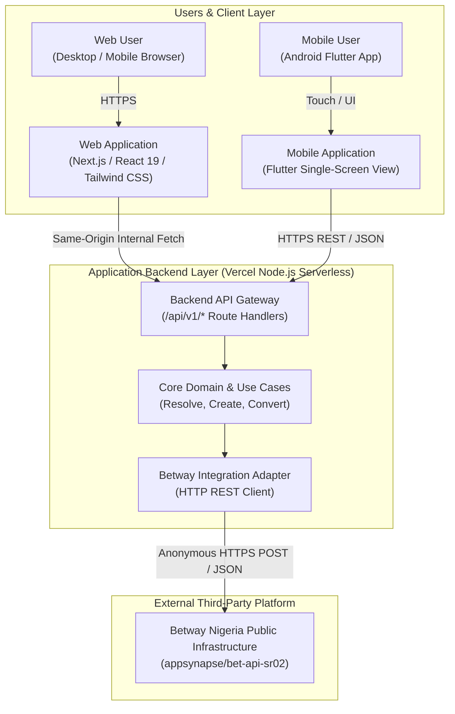
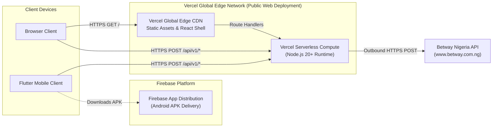
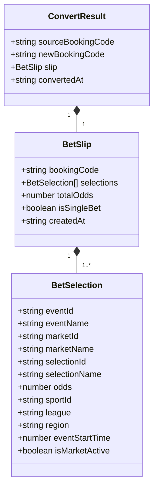
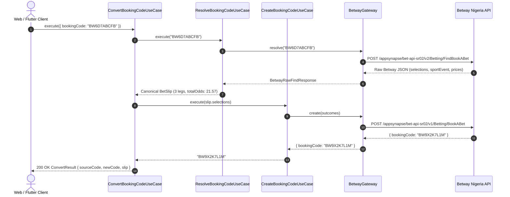
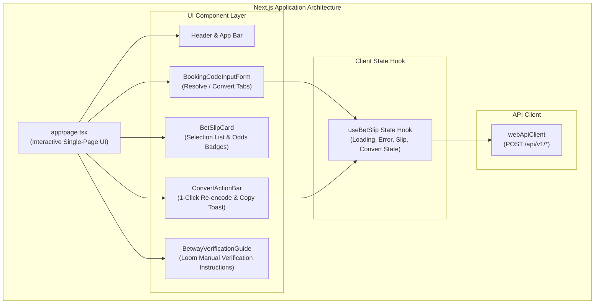
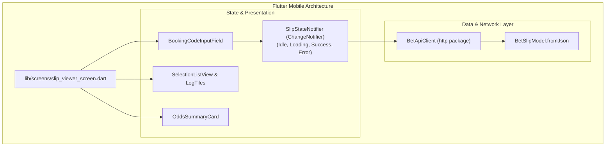
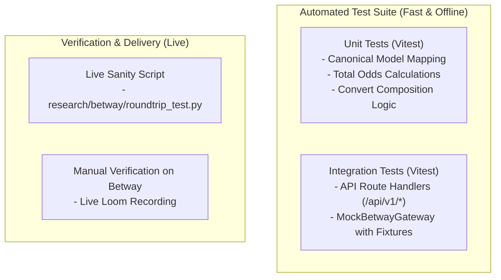

# Betway Nigeria Booking Code Product — Application Architecture v1

**Author**: System Architect  
**Status**: Ready for Implementation  
**Approved Baseline**: [ADR-0001 (Stack Selection)](ADR-0001-stack-selection.md)  
**Target Delivery Window**: 1–2 Days  

---

## 1. Goals and Constraints

This document defines the concrete software architecture for the **Betway Nigeria Booking Code Product**, designed for the **Stellar Logic** technical assessment ([`docs/06-target-role-and-context.md`](../06-target-role-and-context.md)).

### 1.1 Requirements Summary
* **FR-01 (Resolve)**: Ingest any valid Betway Nigeria booking code and decode match events, markets, selections, and odds.
* **FR-02 (Display)**: Render the resolved bet slip in clean Web and Flutter mobile interfaces.
* **FR-03 (Create)**: Accept structured selections and generate a new valid Betway Nigeria booking code.
* **FR-04 (Convert)**: Ingest an existing code/slip and emit a new Betway booking code representing the identical bet.
* **FR-05 (Verify on Betway)**: Enable manual verification by loading generated/converted codes into the live Betway Nigeria website.
* **FR-06 (Flutter View)**: Single-screen mobile viewer consuming the same backend API.
* **Delivery Goals (`NFR-01` to `NFR-09`)**: Public web deployment (Vercel), APK via Firebase App Distribution, clean Git history, Mermaid diagrams, and a 5-minute Loom walkthrough explaining the architecture and trickiest technical decision.

### 1.2 Architectural Constraints
* **Undocumented External Integration**: Betway Nigeria (`betway.com.ng`) has no public API or developer sandbox. All Betway communication must be mediated by our backend gateway.
* **Stateless by Design (YAGNI)**: No relational or document database is required (`NFR-03`). Betway acts as the authoritative external store for booking codes.
* **Time Horizon**: 1–2 days implementation timeline. The architecture prioritizes simplicity, low configuration overhead, and rapid developer velocity.

---

## 2. System Context

The system consists of two thin client applications (Web UI and Flutter Mobile View) interacting with a unified backend service that encapsulates the undocumented Betway Nigeria infrastructure.



### Component Responsibilities

| Component | Responsibility Boundary | Technologies |
| :--- | :--- | :--- |
| **Web Application** | User interaction for decoding, inspecting, creating, and converting slips. Displays verification instructions with direct links to Betway. | Next.js, React 19, Tailwind CSS |
| **Flutter Application** | Lightweight mobile client rendering the resolved slip DTO. | Flutter (Dart), Firebase App Distribution |
| **Backend API Gateway** | Public API contract (`/api/v1/*`), request validation, error masking, and CORS headers. | Next.js Server-Side Route Handlers |
| **Core Domain & Use Cases** | Stateless execution of Resolve, Create, and Convert business logic; canonical data transformations. | Pure TypeScript (Zero external framework dependencies) |
| **Betway Adapter** | Encapsulates Betway Nigeria endpoint URLs, HTTP headers, timeout handling, and fallback routing. | TypeScript HTTP Client (`fetch`) |
| **Betway Nigeria** | External bookmaker providing match fixtures, market odds, and booking code generation. | External Third-Party Service |

---

## 3. Runtime & Deployment Topology

In accordance with [ADR-0001](ADR-0001-stack-selection.md), the system deploys as a **unified full-stack application on Vercel**, paired with mobile APK distribution via **Firebase App Distribution**.



### Runtime Environment & Execution Boundaries
* **Browser Runtime**: Executes React client components, handles user input validation, manages local clipboard copy events, and renders reactive UI state.
* **Server Runtime (Node.js)**: Executes Next.js Route Handlers (`app/api/v1/*`). All Betway outbound requests originate server-side.
* **Network & CORS**:
  * Same-origin for the Web UI (zero CORS preflight latency).
  * CORS headers (`Access-Control-Allow-Origin: *`, `Access-Control-Allow-Methods: POST, GET, OPTIONS`) configured on `/api/v1/*` to support Flutter mobile requests.
* **Environment Configuration**:
  * `BETWAY_BASE_URL`: Default `https://www.betway.com.ng/appsynapse/bet-api-sr02` (fallback: `https://www.betway.com.ng/appsynapse/bet-api-sr`).
  * `BETWAY_TIMEOUT_MS`: Default `8000` (8 seconds).
  * `NODE_ENV`: `production` | `development`.

---

## 4. Core Domain Model

To isolate clients from Betway's raw payload schemas, the application operates exclusively on a **canonical domain model**.



### 4.1 Canonical TypeScript Definitions

```typescript
export interface BetSelection {
  eventId: string;           // e.g. "72221212"
  eventName: string;         // e.g. "Aston Villa vs. Arsenal FC"
  marketId: string;          // e.g. "72221212546"
  marketName: string;        // e.g. "Double Chance & Both Teams To Score (GG/NG)"
  selectionId: string;       // e.g. "722212125461718" (Betway outcome ID)
  selectionName: string;     // e.g. "Aston Villa/Draw & Yes"
  odds: number;              // e.g. 3.35 (decimal odds)
  sportId?: string;          // e.g. "soccer"
  league?: string;           // e.g. "Premier League"
  region?: string;           // e.g. "England"
  eventStartTime?: number;   // Epoch timestamp in seconds
  isMarketActive?: boolean;  // Active status indicator
}

export interface BetSlip {
  bookingCode?: string;      // Betway booking code (e.g. "BW6D7ABCFB")
  selections: BetSelection[];
  totalOdds: number;         // Cumulative product of all selection odds
  isSingleBet: boolean;      // Single vs. Multi bet classification
  createdAt: string;         // ISO timestamp
}

export interface ConvertResult {
  sourceBookingCode: string;
  newBookingCode: string;
  slip: BetSlip;
  convertedAt: string;
}
```

### 4.2 Raw Betway DTO vs. Canonical Model Mapping

```text
Raw Betway Response (POST /Betting/FindBookABet)
  ├── selection.sportEvent.eventId        ──►  BetSelection.eventId
  ├── selection.eventName                 ──►  BetSelection.eventName
  ├── selection.market.marketId           ──►  BetSelection.marketId
  ├── selection.marketName                ──►  BetSelection.marketName
  ├── selection.outcome.outcomeId         ──►  BetSelection.selectionId
  ├── selection.outcomeName               ──►  BetSelection.selectionName
  └── selection.price.priceDecimal        ──►  BetSelection.odds
```

---

## 5. Application Use Cases

The core application logic is implemented as three clean, stateless use cases.

### 5.1 Use Case 1: `ResolveBookingCodeUseCase`
* **Input**: `bookingCode: string` (e.g. `"BW6D7ABCFB"`).
* **Flow**:
  1. Validate booking code format (non-empty alphanumeric, 4–15 characters).
  2. Invoke `BetwayGateway.resolve(bookingCode)`.
  3. Transform raw Betway selections into canonical `BetSelection[]`.
  4. Compute `totalOdds` as the product of all leg odds (rounded to 2 decimal places).
  5. Return canonical `BetSlip`.

### 5.2 Use Case 2: `CreateBookingCodeUseCase`
* **Input**: `selections: BetSelection[]` (or structured selection IDs).
* **Flow**:
  1. Validate that `selections` contains at least 1 valid leg with `selectionId`, `eventId`, and `marketId`.
  2. Map canonical selections into Betway outcomes payload (`{ outcomeId, eventId, marketId, selected: true }`).
  3. Invoke `BetwayGateway.create(outcomes)`.
  4. Extract and return the generated `bookingCode`.

### 5.3 Use Case 3: `ConvertBookingCodeUseCase` (Composition)
* **Input**: `sourceBookingCode: string`.
* **Flow**:
  1. Execute `ResolveBookingCodeUseCase(sourceBookingCode)` to obtain canonical `BetSlip`.
  2. If the slip has no active selections, throw a `STALE_SELECTIONS_ERROR`.
  3. Execute `CreateBookingCodeUseCase(slip.selections)` to generate `newBookingCode`.
  4. Construct and return `ConvertResult` containing `sourceBookingCode`, `newBookingCode`, and the full `slip`.



---

## 6. Backend API Contract

All API endpoints follow a standardized, predictable JSON envelope.

### 6.1 Endpoints Overview

| Method | Path | Description | Success Status |
| :--- | :--- | :--- | :--- |
| `POST` | `/api/v1/resolve` | Decode booking code into canonical BetSlip | `200 OK` |
| `POST` | `/api/v1/create` | Generate booking code from structured selections | `200 OK` |
| `POST` | `/api/v1/convert` | Ingest code/slip and emit new booking code | `200 OK` |
| `GET` | `/api/v1/health` | Service health check | `200 OK` |

---

### 6.2 Endpoint Specifications

#### 1. `POST /api/v1/resolve`
* **Request Body**:
  ```json
  {
    "bookingCode": "BW6D7ABCFB"
  }
  ```
* **Success Response (`200 OK`)**:
  ```json
  {
    "success": true,
    "data": {
      "bookingCode": "BW6D7ABCFB",
      "totalOdds": 21.57,
      "isSingleBet": false,
      "createdAt": "2026-08-31T15:40:00.000Z",
      "selections": [
        {
          "eventId": "72221212",
          "eventName": "Aston Villa vs. Arsenal FC",
          "marketId": "72221212546",
          "marketName": "Double Chance & Both Teams To Score (GG/NG)",
          "selectionId": "722212125461718",
          "selectionName": "Aston Villa/Draw & Yes",
          "odds": 3.35,
          "sportId": "soccer",
          "league": "Premier League",
          "region": "England"
        }
      ]
    }
  }
  ```

#### 2. `POST /api/v1/create`
* **Request Body**:
  ```json
  {
    "selections": [
      {
        "eventId": "72221212",
        "marketId": "72221212546",
        "selectionId": "722212125461718"
      }
    ],
    "isSingleBet": false
  }
  ```
* **Success Response (`200 OK`)**:
  ```json
  {
    "success": true,
    "data": {
      "bookingCode": "BW6D7AC4BA"
    }
  }
  ```

#### 3. `POST /api/v1/convert`
* **Request Body**:
  ```json
  {
    "bookingCode": "BW6D7ABCFB"
  }
  ```
* **Success Response (`200 OK`)**:
  ```json
  {
    "success": true,
    "data": {
      "sourceBookingCode": "BW6D7ABCFB",
      "newBookingCode": "BW6D7AC4BA",
      "convertedAt": "2026-08-31T15:40:05.000Z",
      "slip": {
        "bookingCode": "BW6D7AC4BA",
        "totalOdds": 21.57,
        "isSingleBet": false,
        "createdAt": "2026-08-31T15:40:05.000Z",
        "selections": [
          {
            "eventId": "72221212",
            "eventName": "Aston Villa vs. Arsenal FC",
            "marketId": "72221212546",
            "marketName": "Double Chance & Both Teams To Score (GG/NG)",
            "selectionId": "722212125461718",
            "selectionName": "Aston Villa/Draw & Yes",
            "odds": 3.35
          }
        ]
      }
    }
  }
  ```

---

## 7. Error Model & Status Codes

All errors return a standardized envelope preventing leak of internal stack traces.

### 7.1 Error Response Envelope
```json
{
  "success": false,
  "error": {
    "code": "BOOKING_CODE_NOT_FOUND",
    "message": "The provided Betway booking code could not be found or has expired.",
    "details": null
  }
}
```

### 7.2 Error Taxonomy

| Error Code | HTTP Status | Trigger Condition | Client Guidance |
| :--- | :--- | :--- | :--- |
| `INVALID_INPUT` | `400 Bad Request` | Missing or invalid `bookingCode` format / empty selections array. | Check input syntax. |
| `BOOKING_CODE_NOT_FOUND` | `404 Not Found` | Betway returned `errorCode: 13 (NotFound)` or code is expired. | Verify code on Betway. |
| `STALE_SELECTIONS` | `422 Unprocessable` | Match has already started/concluded or market was suspended. | Reselect active matches. |
| `UPSTREAM_BETWAY_ERROR` | `502 Bad Gateway` | Betway servers unreachable, timed out, or returned 5xx. | Retry in a few moments. |
| `INTERNAL_SERVER_ERROR` | `500 Internal Error` | Unexpected unhandled exception in backend. | Contact support. |

---

## 8. Betway Integration Boundary (Gateway)

The external Betway Nigeria HTTP integration is encapsulated behind a strict interface to enable zero-dependency unit testing and mock substitution.

```typescript
export interface IBetwayGateway {
  resolve(bookingCode: string): Promise<BetwayRawFindResponse>;
  create(outcomes: BetwayOutcomePayload[], isSingleBet?: boolean): Promise<BetwayRawBookResponse>;
}
```

### 8.1 Production Gateway Implementation (`BetwayHttpGateway`)
* **Primary URL**: `https://www.betway.com.ng/appsynapse/bet-api-sr02`
* **Fallback URL**: `https://www.betway.com.ng/appsynapse/bet-api-sr`
* **Timeout**: Enforced 8-second timeout via `AbortSignal.timeout(8000)`.
* **Resilience**: If the primary endpoint fails with network timeout or 503, the gateway automatically retries once against the fallback URL.

### 8.2 Testing Mock Implementation (`MockBetwayGateway`)
* Uses static JSON fixtures (`samples/resolve_response.json`) for fast, deterministic unit and integration testing without network calls.

---

## 9. Web Application Architecture

The web application is implemented inside `web/` using **Next.js (App Router, React 19, TypeScript, Tailwind CSS)**.



### Key UI Features
1. **Unified Input & Fast Actions**: Quick paste box supporting both direct Decode and instant Convert.
2. **Interactive Slip Display**: Event fixture badges, market headers, selection names, and individual/cumulative odds.
3. **Conversion Comparison**: Visual comparison between original code and newly generated code with 1-click clipboard copy.
4. **Verification Helper**: Embedded modal providing direct links to `betway.com.ng` with copyable codes for seamless Loom walkthrough verification.

---

## 10. Flutter Mobile Architecture

The mobile application is a lightweight, single-screen Flutter application located in `mobile/`.



### Delivery Workflow
1. **Android Build**: Compiled to release APK (`flutter build apk --release`).
2. **Distribution**: Uploaded to **Firebase App Distribution** for instant tester download.
3. **iOS Path Note**: Documented in `mobile/README.md` describing standard TestFlight / Fastlane IPA signing and distribution.

---

## 11. Repository Structure

```text
/
├── README.md                           # Project overview, status, documentation links
├── AGENTS.md                           # Ticket workflow & agent instructions
├── docs/                               # Source-of-truth documentation
│   ├── 00-assessment-brief.md
│   ├── 01-requirements.md
│   ├── 02-clarifications.md
│   ├── 03-betway-integration-findings.md
│   ├── 04-scope-and-boundaries.md
│   ├── 05-open-questions-and-risks.md
│   ├── 06-target-role-and-context.md
│   ├── resources/
│   │   └── Technical_Assessment.pdf    # Original assessment brief PDF
│   └── architecture/
│       ├── 01-stack-options.md         # Technology stack study
│       ├── ADR-0001-stack-selection.md # Formally accepted stack decision
│       └── 02-application-architecture.md # THIS PRIMARY SPECIFICATION
├── research/
│   └── betway/                         # Forensic spike evidence
│       ├── resolve.sh
│       ├── create.sh
│       ├── roundtrip_test.py
│       └── samples/
├── web/                                # Next.js Full-Stack Application
│   ├── src/
│   │   ├── app/
│   │   │   ├── api/v1/                 # Backend Route Handlers
│   │   │   │   ├── resolve/route.ts
│   │   │   │   ├── create/route.ts
│   │   │   │   ├── convert/route.ts
│   │   │   │   └── health/route.ts
│   │   │   ├── layout.tsx
│   │   │   ├── page.tsx                # Main Web UI
│   │   │   └── globals.css
│   │   ├── components/                 # React UI components
│   │   │   ├── BetSlipCard.tsx
│   │   │   ├── BookingCodeInput.tsx
│   │   │   ├── ConvertPanel.tsx
│   │   │   └── VerificationGuide.tsx
│   │   ├── core/                       # Pure Business Domain (Framework-Agnostic)
│   │   │   ├── domain/                 # Canonical models (BetSlip, BetSelection)
│   │   │   ├── use-cases/              # Resolve, Create, Convert interactors
│   │   │   ├── gateway/                # IBetwayGateway & BetwayHttpGateway
│   │   │   └── errors/                 # AppError taxonomy
│   │   └── lib/                        # Validation helpers, DTO mappers
│   ├── tests/                          # Unit & integration test suites
│   │   ├── fixtures/
│   │   ├── use-cases/
│   │   └── api/
│   ├── package.json
│   └── tsconfig.json
└── mobile/                             # Flutter Single-Screen Application
    ├── lib/
    │   ├── core/                       # API constants & HTTP client
    │   ├── models/                     # Canonical DTO models
    │   ├── screens/                    # SlipViewScreen
    │   └── main.dart
    ├── pubspec.yaml
    └── README.md                       # Android APK & iOS IPA notes
```

---

## 12. Dependency Rules

```text
[UI Components / Web / Flutter]
             │
             ▼
[Application Use Cases (Resolve, Create, Convert)]
             │
             ▼
[Domain Models (BetSlip, BetSelection) & Gateway Interface (IBetwayGateway)]
             ▲
             │ (implements)
[Infrastructure: BetwayHttpGateway]
             │
             ▼
[External Betway Public API]
```

* **Rule 1**: The `core/domain/` layer has **zero dependencies** on React, Next.js, Flutter, or UI libraries.
* **Rule 2**: `core/use-cases/` depend only on `core/domain/` and `core/gateway/` interfaces.
* **Rule 3**: Next.js route handlers (`app/api/v1/*`) instantiate use cases and gateways via dependency injection.
* **Rule 4**: External Betway DTOs exist only inside `core/gateway/` and are never imported by UI layers.

---

## 13. Testing Strategy

The test strategy prioritizes high-confidence deterministic testing over brittle live network calls.



### Test Classification

| Test Suite | Priority | Scope | Execution Trigger |
| :--- | :--- | :--- | :--- |
| **Domain & Use Case Unit Tests** | **MANDATORY** | Transformation logic, odds calculation, Convert composition, error taxonomy. | Pre-commit / CI |
| **API Route Handler Tests** | **MANDATORY** | Request validation, status codes, JSON envelope formatting using `MockBetwayGateway`. | Pre-commit / CI |
| **Live Integration Verification** | **VALUABLE** | `roundtrip_test.py` against live Betway endpoints. | Manual verification milestone |
| **Live Loom Demonstration** | **MANDATORY** | 5-minute video recording loading generated codes into `betway.com.ng`. | Assessment submission |
| **Full Headless E2E Browser Suite** | **EXCLUDED** | Brittle Playwright tests against Betway's live WAF. | Not required (Per clarification) |

---

## 14. Security and External Boundary

* **No Credential Exposure**: Betway endpoints operate anonymously; no API keys or secrets exist to leak.
* **Strict Input Validation**: Booking codes must conform to `^[A-Za-z0-9]{4,15}$`. Invalid inputs are rejected at the gateway before making outbound calls.
* **Timeout Protection**: Outbound Betway requests enforce an 8-second timeout, preventing hanging serverless functions.
* **Upstream Error Masking**: Unhandled upstream failures return a sanitized `502 Bad Gateway` (`UPSTREAM_BETWAY_ERROR`) without leaking external server stack traces.

---

## 15. Architecture Invariants

Future implementation and review agents must enforce these non-negotiable invariants:

* **INV-01**: Neither Web nor Flutter clients may ever call Betway Nigeria endpoints directly.
* **INV-02**: Raw Betway DTOs must never be exposed as the public client API contract. All responses must be normalized into canonical models.
* **INV-03**: Web UI and Flutter Mobile view must consume identical `/api/v1/*` backend contracts.
* **INV-04**: No database or persistent storage layer may be introduced without an approved architectural change.
* **INV-05**: The `Convert` operation must compose `Resolve` and `Create` primitives rather than duplicating Betway integration logic.
* **INV-06**: All live Betway communication must be encapsulated behind `IBetwayGateway` to enable deterministic fixture-based testing.

---

## 16. Implementation Workstreams

The project decomposes into 4 parallelizable implementation workstreams:

```text
[WS-1: Core Domain & Backend Gateway] ──► [WS-2: Web Application UI] ────┐
                                      └──► [WS-3: Flutter Mobile View] ──┼──► [WS-4: Deployment & Loom Walkthrough]
```

1. **Workstream 1: Core Domain & Backend API (Foundation)**
   * Deliverables: TypeScript domain models, `IBetwayGateway` & `BetwayHttpGateway`, use cases (`Resolve`, `Create`, `Convert`), API route handlers (`/api/v1/*`), Vitest unit/integration test suites.
   * Dependencies: None (First to execute).
2. **Workstream 2: Web Application UI**
   * Deliverables: Next.js responsive UI (`app/page.tsx`), Tailwind styling, React client hooks, verification helper modal.
   * Dependencies: Workstream 1.
3. **Workstream 3: Flutter Mobile View**
   * Deliverables: Flutter single-screen slip viewer, HTTP API client, Android APK build, Firebase App Distribution configuration, iOS IPA documentation note.
   * Dependencies: Workstream 1.
4. **Workstream 4: Deployment & Final Verification**
   * Deliverables: Vercel public deployment, live verification on `betway.com.ng`, 5-minute Loom walkthrough recording, solution explanation summary.
   * Dependencies: Workstreams 2 & 3.

---

## 17. Recommended Future Agent Competencies

For the subsequent implementation phase, the following specialized agent roles are derived directly from the architecture:

1. **Full-Stack TypeScript Engineer**: Implements core domain models, gateway adapter, use cases, API route handlers, and Next.js Web UI (`INV-01`, `INV-02`, `INV-05`, `INV-06`).
2. **Flutter Mobile Engineer**: Implements the single-screen mobile viewer and handles Firebase App Distribution packaging (`INV-03`).
3. **Code & Architecture Reviewer**: Validates that implementation PRs preserve all architecture invariants (`INV-01` to `INV-06`) and maintain 100% test coverage.

---

## 18. Open Implementation Decisions

* **Status**: **No blocking architecture decisions remain.**
* All functional requirements, constraints, API contracts, domain models, and deployment topologies are fully specified and ready for implementation planning.
