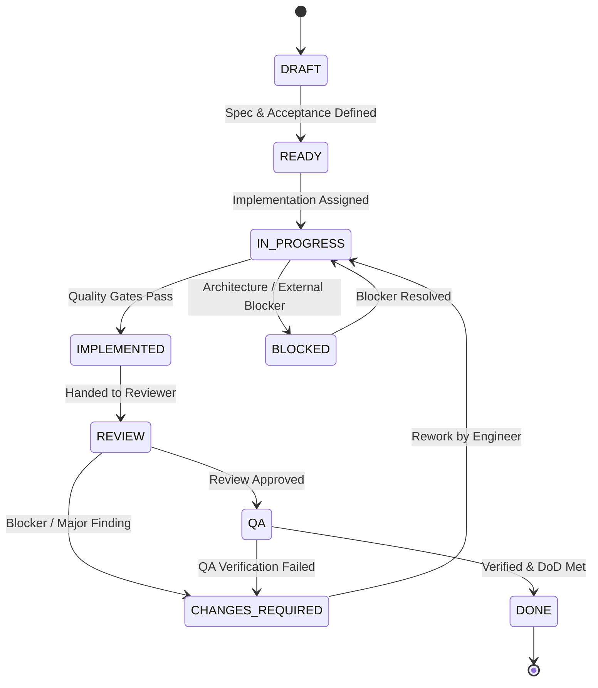
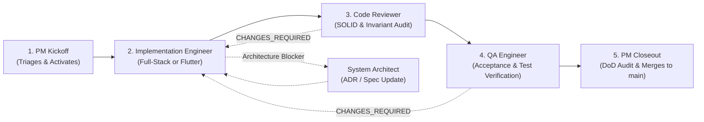

# Repository Development & Delivery Workflow

This document defines the disciplined, ticket-driven development workflow, ticket lifecycle, agent handoff pipeline, Git branching strategy, and Definition of Done for this repository.

---

## 1. Ticket Lifecycle

Every implementation task moves through a formal, structured lifecycle:



### State Definitions

| State | Responsible Agent | Definition & Exit Criteria |
| :--- | :--- | :--- |
| **`DRAFT`** | Project Manager / Architect | Ticket objectives, context, scope, and non-goals are being drafted. |
| **`READY`** | Project Manager | Ticket is fully specified with clear acceptance criteria, references, and a strict `STOP CONDITION`. Ready for assignment. |
| **`IN_PROGRESS`** | Implementation Engineer | Actively being developed by Full-Stack TypeScript Engineer or Flutter Engineer. |
| **`BLOCKED`** | Project Manager / Architect | Work halted due to an unaddressed architectural question or external dependency. |
| **`IMPLEMENTED`** | Implementation Engineer | Code changes complete, local quality gates pass (`lint`, `typecheck`, `test`, `build`), and changes committed to ticket branch. |
| **`REVIEW`** | Code & Architecture Reviewer | Independent structural, SOLID, invariant, and scope audit. |
| **`CHANGES_REQUIRED`** | Implementation Engineer | Rework requested due to `BLOCKER` or `MAJOR` review findings or failed QA. |
| **`QA`** | QA / Verification Engineer | Independent runtime verification against acceptance criteria and quality gates. |
| **`DONE`** | Project Manager | All criteria satisfied, review and QA approved, merged to `main`, and ticket archived. |

---

## 2. Agent Handoff Pipeline & Multi-Agent Orchestration

Implementation progresses sequentially through specialized, isolated agent boundaries.



### 2.1 Multi-Agent Orchestration Execution Model

When instructed with the standardized command:
```text
Execute <Ticket-ID> using the repository multi-agent delivery workflow.
```
The Parent Agent operates strictly as the **Orchestrator** and drives the lifecycle through explicit subagents:

1. **Non-Implementation Invariant**: The Parent Agent **MUST NOT** implement product code, modify architecture, perform code review, or perform QA verification directly in the parent context.
2. **Strict Subagent Isolation**: Every lifecycle stage MUST be executed by a separate subagent invoked via `invoke_subagent` using `Workspace: "inherit"`.
3. **Mandatory Role & Skill Loading**: Before performing work, each subagent MUST load its designated role instructions (`agents/<role>.md`) and skill (`skills/<skill>/SKILL.md`).
4. **Lifecycle Stages**:
   * **Stage 1 — PM Kickoff** (`Role: "Project / Delivery Manager"`, `TypeName: "project_delivery_manager"`):
     * Verifies upstream ticket dependencies are `DONE`.
     * Verifies target ticket is `READY`.
     * Verifies `main` working tree is clean.
     * Creates and switches to ticket branch `ticket/<Ticket-ID>-<short-name>`.
     * Moves ticket from `tickets/backlog/` to `tickets/active/` and marks status `IN_PROGRESS`.
     * Updates `tickets/README.md` and commits kickoff changes to the branch.
     * Emits structured Kickoff Report (or `BLOCKED` if unsafe).
   * **Stage 2 — Implementation** (`Role: "Full-Stack TypeScript Engineer"` | `"Flutter Engineer"`, `TypeName: "full_stack_typescript_engineer"` | `"flutter_engineer"`):
     * Operates on ticket branch; implements the ticket-defined deliverables.
     * Runs all local quality gates (`lint`, `typecheck`, `test`, `build` or Flutter equivalents).
     * Fixes internal failures, updates ticket status to `IMPLEMENTED`, and commits changes with conventional commit messages.
     * Emits structured Implementation Report.
   * **Stage 3 — Independent Code & Architecture Review** (`Role: "Code & Architecture Reviewer"`, `TypeName: "code_architecture_reviewer"`):
     * MUST be an independent subagent from the implementing engineer.
     * Audits git diff, acceptance criteria, SOLID boundaries, and invariants `INV-01`–`INV-06`.
     * Emits formal Review Verdict (`APPROVED`, `APPROVED WITH MINOR COMMENTS`, or `CHANGES REQUIRED`).
   * **Stage 4 — Independent QA Verification** (`Role: "QA / Verification Engineer"`, `TypeName: "qa_verification_engineer"`):
     * MUST be an independent subagent from the engineer and reviewer.
     * Executes automated quality gates and verifies ticket criteria with executable evidence.
     * Emits formal QA Verdict (`VERIFIED`, `CHANGES REQUIRED`, or `BLOCKED`).
   * **Stage 5 — PM Closeout & Integration** (`Role: "Project / Delivery Manager"`, `TypeName: "project_delivery_manager"`):
     * Verifies Reviewer (`APPROVED`) and QA (`VERIFIED`) sign-offs.
     * Audits the 8-point Definition of Done.
     * Updates ticket status to `DONE` and moves ticket from `tickets/active/` to `tickets/done/`.
     * Updates `tickets/README.md` (completed ticket `DONE`, next ticket `READY`).
     * Commits closeout changes to the ticket branch.
     * Merges ticket branch into `main` (`git checkout main && git merge --no-ff ...`).
     * Verifies quality gates on `main` and emits structured Closeout Report.

### 2.2 Rework & Escalation Loops

* **Review Finding Loop**: If Reviewer issues `CHANGES REQUIRED`, the Parent Agent invokes a **fresh** Implementation Engineer subagent with the correction brief, waits for commit, and then invokes a **fresh** Code Reviewer subagent.
* **QA Defect Loop**: If QA issues `CHANGES REQUIRED`, the Parent Agent invokes a **fresh** Implementation Engineer subagent with the defect report, waits for commit, then routes through a **fresh** Reviewer, and finally a **fresh** QA Engineer.
* **Architectural Escalation**: If an engineer or reviewer encounters an unresolvable structural ambiguity or contract conflict, the ticket is marked `BLOCKED` and the Parent Agent invokes a separate **System Architect** subagent (`Role: "System Architect"`, `TypeName: "system_architect"`) to produce an ADR or spec update before unblocking.

### 2.3 Operating Guardrails

1. **Review Before QA**: QA verification begins **only after** the Code Reviewer has issued `APPROVED` or `APPROVED WITH MINOR COMMENTS`.
2. **Stop Condition**: Stop immediately when a blocker occurs or when the ticket reaches `DONE`.
3. **No Automatic Progression**: Agents **must never** automatically begin the next ticket in the backlog without an explicit user prompt.

---

## 3. Standard Ticket Format

All tickets in `tickets/` follow a uniform, concise structure:

```markdown
# [Ticket ID] — [Ticket Title]

* **Owner**: [Full-Stack TypeScript Engineer | Flutter Engineer | System Architect | QA]
* **Status**: [DRAFT | READY | IN_PROGRESS | IMPLEMENTED | REVIEW | QA | DONE]
* **Branch**: `ticket/[Ticket-ID]-[short-name]`

## 1. Objective
[1-2 sentences explaining what this ticket achieves]

## 2. Context & References
* Architectural Spec: `docs/architecture/02-application-architecture.md`
* Relevant Invariants: `INV-01`, `INV-02`, etc.
* Upstream ADRs: `docs/architecture/ADR-0001-stack-selection.md`

## 3. Scope & Deliverables
* [Explicit file or component to create/modify]
* [Concrete deliverable]

## 4. Non-Goals
* [Explicitly excluded scope to prevent creep]

## 5. Acceptance Criteria
1. [Criterion 1]
2. [Criterion 2]

## 6. Verification Plan
* Command checks: `npm run test`, `npm run lint`, etc.
* Manual verification steps if applicable.

## 7. STOP CONDITION
Stop immediately when [exact condition met]. Do not [downstream actions].
```

---

## 4. Git & Branching Workflow

A lightweight, reviewable branching strategy designed for atomic assessment tracking:

```text
main  ───────────────────────────────────────────●───────●─────────►
        \                                       /       /
         \── ticket/T010-core-domain ──────────/       /
          \                                           /
           \── ticket/T011-web-ui ───────────────────/
```

### 4.1 Branching Rules
* **`main` Branch**: Remains clean, stable, and always in a passing state.
* **Feature / Ticket Branches**: Named `ticket/<ticket-id>-<short-name>` (e.g. `ticket/T010-core-domain`, `ticket/T011-flutter-slip-screen`).
* **Short-Lived**: One ticket maps to one short-lived branch.
* **No GitFlow Bloat**: No permanent `develop` branch or complex release branches.

### 4.2 Commit Standards & History
* Commit incrementally while working; Git history is an explicit assessment deliverable (`NFR-05`).
* Use concise conventional commit prefixes:
  * `feat:` for new features or capabilities.
  * `fix:` for bug fixes.
  * `test:` for test suites and fixtures.
  * `docs:` for documentation, ADRs, and specs.
  * `refactor:` for code restructuring without behavioral changes.
  * `chore:` for repository setup, agent definitions, and maintenance.
* **Never Squash Meaningful History**: Maintain a clear chronological record of engineering milestones.

---

## 5. Definition of Done (DoD)

An implementation ticket is considered **`DONE`** only when all of the following conditions are met:

1. **Acceptance Criteria**: All functional and non-functional acceptance criteria defined in the ticket are 100% satisfied.
2. **Quality Gates Passed**:
   * For Web: `npm run lint`, `npm run typecheck`, `npm run test`, and `npm run build` pass with zero errors/warnings.
   * For Mobile: `flutter analyze`, `dart format`, and `flutter test` pass with zero errors/warnings.
3. **Code Review Approval**: The Code & Architecture Reviewer has issued `APPROVED` or `APPROVED WITH MINOR COMMENTS` (zero unresolved `BLOCKER` or `MAJOR` findings).
4. **Architectural Invariants**: Audited and confirmed compliance with `INV-01` through `INV-06`.
5. **QA Verification**: The QA / Verification Engineer has executed the verification plan and confirmed expected runtime behavior with evidence.
6. **Documentation Updated**: Relevant repository docs or diagrams reflect any changes.
7. **Clean Git State**: Changes are cleanly committed to Git without extraneous untracked files or leftover debug logs.
8. **No Scope Creep**: No unapproved packages, database entities, or out-of-scope features have been introduced.

---

## 6. Ticket Storage Layout

Tickets are tracked directly in the repository under `tickets/`:

```text
tickets/
├── README.md           # Backlog summary and current sprint status
├── backlog/            # Ready or Draft tickets waiting for pickup
├── active/             # Tickets currently IN_PROGRESS, REVIEW, or QA
└── done/               # Completed tickets moved here upon reaching DONE
```
