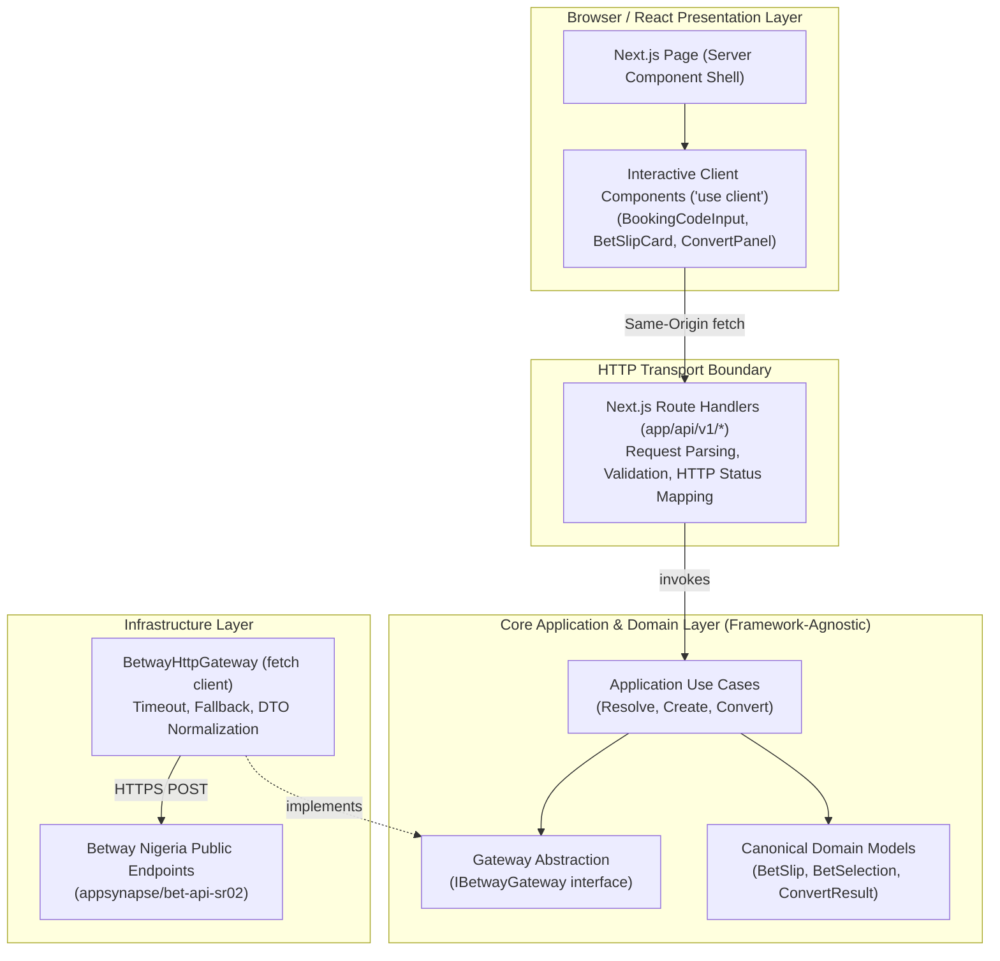

# Full-Stack TypeScript Engineering Skill

This skill defines the technical standards, architectural boundaries, and implementation practices for the full-stack Web application (`web/`) in this repository.

---

## 1. Architectural Baseline & Responsibility Flow

The full-stack application strictly preserves separation between browser presentation, HTTP transport, application use cases, domain logic, and external infrastructure:



---

## 2. Server vs. Client Boundaries in Next.js

1. **Server Components by Default**:
   * Layouts (`layout.tsx`) and page shells (`page.tsx`) remain Server Components.
   * Server Components render the initial HTML, meta tags, and static layout without shipping JavaScript to the client.
2. **Client Components at Interactive Leaves**:
   * Add `'use client'` strictly at the smallest interactive boundary requiring browser state, form inputs, or event handlers (`BookingCodeInput`, `ConvertPanel`, `BetSlipCard`).
   * **DO NOT** mark the entire page tree as `'use client'` simply because one child component is interactive.
3. **No Server Leakage**:
   * Client components interact with backend logic **only** via `/api/v1/*` HTTP calls. They never import server-side gateways, Betway endpoints, or Node.js environment variables.

---

## 3. Thin Route Handlers

Next.js Route Handlers (`app/api/v1/*/route.ts`) act purely as the **HTTP transport boundary**.

```text
Incoming HTTP Request
       ↓
Parse JSON & Validate Input Schema (e.g. Zod)
       ↓
Invoke Application Use Case (Resolve / Create / Convert)
       ↓
Map Domain Result / AppError to HTTP Status & JSON Envelope
       ↓
Return NextResponse.json({ success, data | error })
```

### Route Handler Rules:
* **Thin & Declarative**: Handlers must not contain inline Betway normalization, Convert orchestration, or endpoint URLs.
* **Standardized JSON Envelope**:
  * Success: `NextResponse.json({ success: true, data: result }, { status: 200 })`
  * Error: `NextResponse.json({ success: false, error: { code, message, details } }, { status })`
* **CORS**: Set permissive headers (`Access-Control-Allow-Origin: *`, `Access-Control-Allow-Methods: POST, GET, OPTIONS`) on `/api/v1/*` to support the Flutter mobile client (`INV-03`).

---

## 4. Application Use Cases & Convert Composition

Business operations live inside `src/core/use-cases/` and are pure, testable TypeScript classes or functions.

### 4.1 Approved Use Cases
1. `ResolveBookingCodeUseCase`: Ingests `bookingCode`, calls `gateway.resolve(bookingCode)`, and normalizes into canonical `BetSlip`.
2. `CreateBookingCodeUseCase`: Ingests canonical selections, maps to Betway outcomes payload, calls `gateway.create(outcomes)`, and returns `newBookingCode`.
3. `ConvertBookingCodeUseCase`: **Stateless Composition** (`INV-05`).
   * Step 1: `ResolveBookingCodeUseCase.execute(sourceCode)` → obtains canonical `BetSlip`.
   * Step 2: Validates active selections exist.
   * Step 3: `CreateBookingCodeUseCase.execute(slip.selections)` → obtains `newBookingCode`.
   * Step 4: Returns `ConvertResult` containing original code, new code, and slip summary.

---

## 5. Betway Gateway Abstraction & Isolation

All undocumented Betway integration logic is encapsulated in `src/core/gateway/`.

### 5.1 Gateway Interface (`IBetwayGateway`)
```typescript
export interface IBetwayGateway {
  resolve(bookingCode: string): Promise<BetwayRawFindResponse>;
  create(outcomes: BetwayOutcomePayload[], isSingleBet?: boolean): Promise<BetwayRawBookResponse>;
}
```

### 5.2 Implementation Standards (`BetwayHttpGateway`)
* **Primary URL**: `https://www.betway.com.ng/appsynapse/bet-api-sr02` (Fallback: `.../bet-api-sr`).
* **Timeout**: Enforce an 8-second timeout via `AbortSignal.timeout(8000)`.
* **Headers**: Send standard browser `User-Agent` and `Content-Type: application/json`.
* **Error Translation**: Catch network timeouts and 5xx responses, mapping them to `AppError('UPSTREAM_BETWAY_ERROR', 502)`.
* **Never Leak Raw DTOs**: Convert raw Betway response objects into canonical `BetSlip` and `BetSelection` domain models (`INV-02`).

---

## 6. TypeScript Baseline & Runtime Validation

1. **Strict TypeScript Configuration**:
   * `"strict": true`, `"noImplicitAny": true`, `"strictNullChecks": true`.
   * Explicit return types for public functions, use cases, and API route handlers.
2. **No Unsafe Type Escapes**:
   * **Banned**: `any`, non-null assertions `!`, and blind type casts `as MyType` without validation.
   * Use `unknown` for incoming untrusted payloads, followed by schema validation or type guards.
3. **Runtime Boundary Validation (Zod)**:
   * Validate all incoming request bodies at `/api/v1/*` using lightweight Zod schemas.
   * Reject invalid formats (`400 Bad Request`) before invoking use cases.

---

## 7. React UI & State Engineering

1. **Lightweight Component-Local State**:
   * Use React hooks (`useState`, `useTransition`, `useCallback`) for loading, error, and slip data.
   * Do not introduce Redux, Zustand, or MobX for this single-page assessment flow.
2. **Decomposed Component Responsibilities**:
   * `BookingCodeInputForm`: Input box, tab switching (Resolve vs. Convert), submit buttons.
   * `BetSlipCard`: Event fixtures, market names, selection badges, individual/total odds.
   * `ConvertActionBar`: One-click re-encode button, diff comparison, copy-to-clipboard toast.
   * `VerificationGuideModal`: Instructions and direct link to `betway.com.ng` for Loom recording.
3. **Accessibility & Semantics**:
   * Proper `<label>`, `<button>`, and ARIA attributes for interactive elements.
   * Keyboard submit handling and focus management.

---

## 8. Lightweight Dependency Injection

* Do not introduce heavy DI frameworks (`inversify`, `tsyringe`).
* Use **constructor / factory parameter injection**:
  ```typescript
  export class ConvertBookingCodeUseCase {
    constructor(private readonly gateway: IBetwayGateway) {}
    async execute(request: ConvertRequest): Promise<ConvertResult> { ... }
  }
  ```
* In Route Handlers, instantiate the use case passing `new BetwayHttpGateway()`.
* In tests, pass `new MockBetwayGateway(fixtures)`.

---

## 9. Error Model & Status Codes

Standardized error hierarchy in `src/core/errors/AppError.ts`:

| Error Code | HTTP Status | Trigger Condition |
| :--- | :--- | :--- |
| `INVALID_INPUT` | `400 Bad Request` | Malformed booking code syntax or empty selections. |
| `BOOKING_CODE_NOT_FOUND` | `404 Not Found` | Betway returned `NotFound` or expired code. |
| `STALE_SELECTIONS` | `422 Unprocessable` | Markets closed / events concluded. |
| `UPSTREAM_BETWAY_ERROR` | `502 Bad Gateway` | Betway unreachable or timed out. |
| `INTERNAL_SERVER_ERROR` | `500 Internal Error` | Uncaught runtime error. |

---

## 10. Testing Strategy (Vitest)

1. **Core Domain & Use Case Tests (Mandatory)**:
   * Test `Resolve`, `Create`, and `Convert` using `MockBetwayGateway`.
   * Test Convert composition without calling Betway over the network.
   * Test total odds computation and error propagation.
2. **Gateway Normalization Tests (Mandatory)**:
   * Test `BetwayHttpGateway` normalization against sanitized static fixtures (`research/betway/samples/resolve_response.json`).
3. **Route Handler Integration Tests (Mandatory)**:
   * Test `/api/v1/resolve`, `/api/v1/create`, and `/api/v1/convert` for valid 200 responses, 400 validation failures, and 502 upstream errors.
4. **React UI Component Tests (Valuable)**:
   * Test slip rendering, loading indicators, and error feedback using React Testing Library / Vitest.

---

## 11. Quality Gate Checklist

Before completing any implementation ticket, the Full-Stack Engineer must verify:
```bash
npm run lint         # Zero ESLint errors or warnings
npm run typecheck    # tsc --noEmit passes with zero errors
npm run test         # Vitest test suite passes 100%
npm run build        # Next.js production build succeeds
```
