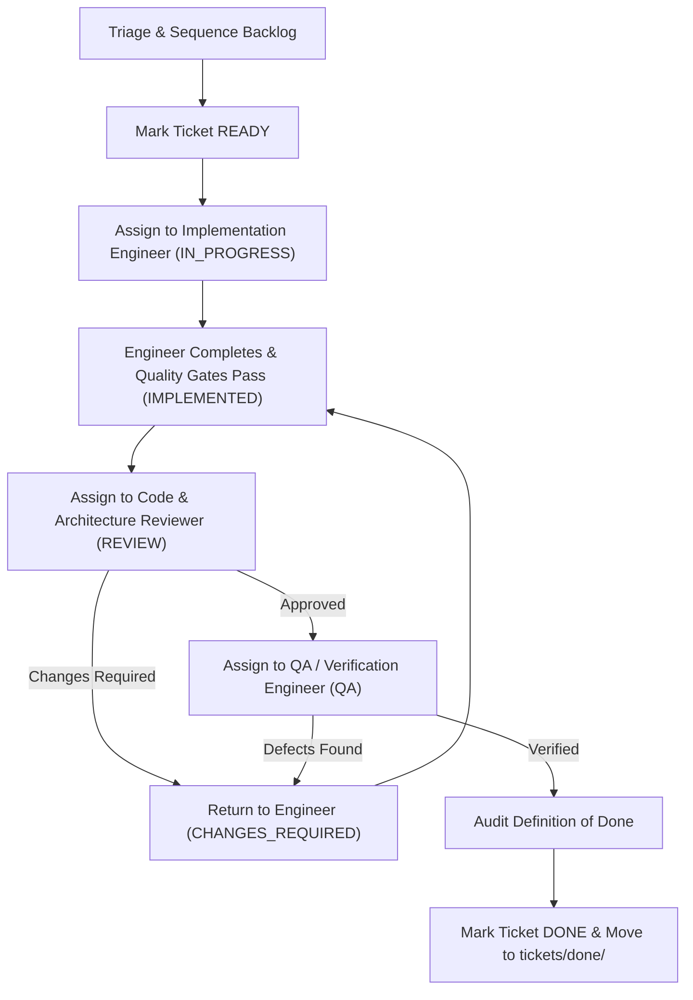

# Project & Delivery Management Skill

This skill defines the operational practices, ticket sequencing rules, agent handoff orchestration, and Definition of Done governance for managing the repository delivery lifecycle.

---

## 1. Core Principles of Delivery Management

* **Strict Scope Discipline**: Every ticket must have a razor-sharp scope, non-goals, and an explicit `STOP CONDITION`.
* **Sequential Quality Gating**: No ticket moves to `QA` without an approved Code Review; no ticket moves to `DONE` without QA verification.
* **No Unplanned Progression**: Agents never start subsequent tickets automatically; all transitions are governed by explicit status progression.
* **Non-Implementation Boundary**: The Project / Delivery Manager orchestrates and validates work without writing application code or performing independent reviews.

---

## 2. Ticket Authoring & Sizing

When creating or refining tickets in `tickets/backlog/`:

1. **Keep Tickets Small**: Size tickets to be completable within 1–3 hours of focused agent execution.
2. **Mandatory Ticket Sections**:
   * **ID & Title**: e.g. `T010 — Implement Core Domain & Betway Adapter`
   * **Owner**: Dedicated specialist (`Full-Stack TypeScript Engineer` | `Flutter Engineer` | `QA Engineer`)
   * **Status**: `READY`
   * **Branch**: `ticket/<ID>-<short-name>`
   * **Context & References**: Exact links to `docs/architecture/02-application-architecture.md`, relevant `INV-*` invariants, and ADRs.
   * **Explicit Scope & Non-Goals**: Demarcate what is in-scope vs. excluded.
   * **Acceptance Criteria**: Testable, numbered verification items.
   * **STOP CONDITION**: Unambiguous stopping instruction.

---

## 3. Handoff Orchestration & State Transitions

The Delivery Manager executes and monitors the handoff pipeline:

### Transition Actions:
* **`READY` → `IN_PROGRESS`**: Move ticket file from `tickets/backlog/` to `tickets/active/`.
* **`IMPLEMENTED` → `REVIEW`**: Verify that local quality gates passed; assign `Code & Architecture Reviewer`.
* **`REVIEW` → `QA`**: Verify `APPROVED` or `APPROVED WITH MINOR COMMENTS` verdict; assign `QA / Verification Engineer`.
* **`QA` → `DONE`**: Audit the 8-point Definition of Done; move ticket file from `tickets/active/` to `tickets/done/`.

---

## 4. Blocker Resolution & Architectural Escalation

If an implementing engineer or reviewer reports a structural question, ambiguity, or contract conflict:
1. Mark ticket as **`BLOCKED`**.
2. Formally route the question to the **System Architect**.
3. Once an updated ADR or architecture amendment is committed, unblock the ticket and resume **`IN_PROGRESS`**.

---

## 5. Definition of Done (DoD) Verification Checklist

Before marking any implementation ticket as `DONE`, the Delivery Manager must explicitly verify:
- [ ] All ticket acceptance criteria are satisfied.
- [ ] Automated quality gates pass (`npm run test`, `npm run lint`, `npm run typecheck`, `npm run build` or Flutter equivalents).
- [ ] Code & Architecture Reviewer issued `APPROVED` (zero `BLOCKER` or `MAJOR` findings).
- [ ] QA / Verification Engineer verified runtime behavior with reproducible evidence.
- [ ] Architectural invariants (`INV-01` to `INV-06`) are preserved.
- [ ] Relevant documentation has been updated.
- [ ] Commits follow conventional message format on the designated ticket branch.
- [ ] No scope creep or unapproved dependencies were introduced.
