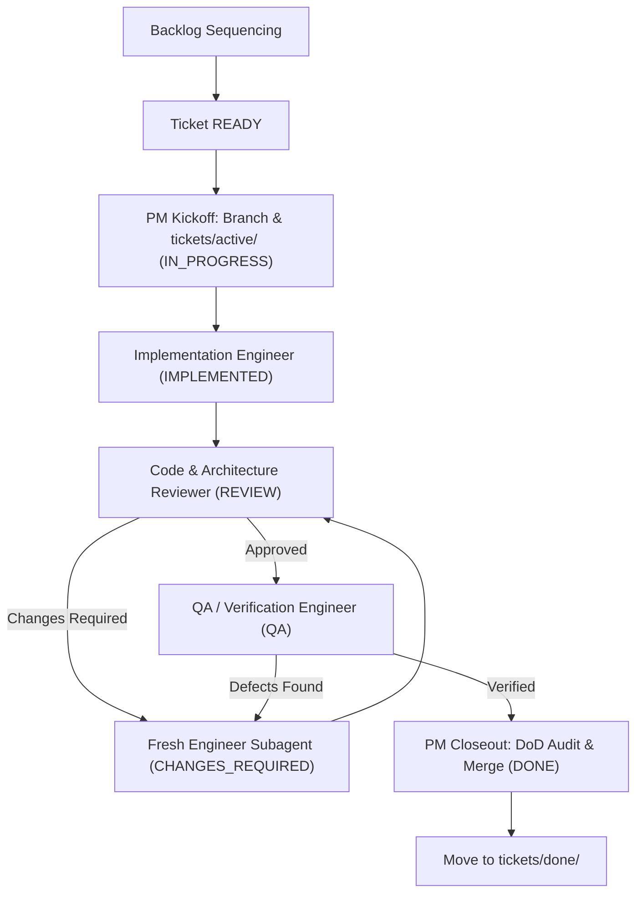

# Project & Delivery Management Skill

This skill defines the operational practices, ticket sequencing rules, agent handoff orchestration, and Definition of Done governance for managing the repository delivery lifecycle.

---

## 1. Core Principles of Delivery Management

* **Strict Scope Discipline**: Every ticket must have a razor-sharp scope, non-goals, and an explicit `STOP CONDITION`.
* **Sequential Quality Gating**: No ticket moves to `QA` without an approved Code Review; no ticket moves to `DONE` without QA verification.
* **No Unplanned Progression**: Agents never start subsequent tickets automatically; all transitions are governed by explicit status progression.
* **Non-Implementation Boundary**: The Project / Delivery Manager orchestrates and validates work without writing application code or performing independent reviews.

---

## 2. Ticket Authoring & Sizing

When creating or refining tickets in `tickets/backlog/`:

1. **Keep Tickets Small**: Size tickets to be completable within 1–3 hours of focused agent execution.
2. **Mandatory Ticket Sections**:
   * **ID & Title**: e.g. `T010 — Implement Core Domain & Betway Adapter`
   * **Owner**: Dedicated specialist (`Full-Stack TypeScript Engineer` | `Flutter Engineer` | `QA Engineer`)
   * **Status**: `READY`
   * **Branch**: `ticket/<ID>-<short-name>`
   * **Context & References**: Exact links to `docs/architecture/02-application-architecture.md`, relevant `INV-*` invariants, and ADRs.
   * **Explicit Scope & Non-Goals**: Demarcate what is in-scope vs. excluded.
   * **Acceptance Criteria**: Testable, numbered verification items.
   * **STOP CONDITION**: Unambiguous stopping instruction.

---

## 3. Handoff Orchestration & State Transitions

The Delivery Manager owns the kickoff and closeout boundaries of the 5-phase multi-agent pipeline:

### 3.1 PM Kickoff Procedure (`READY` → `IN_PROGRESS`)
1. Verify upstream ticket dependencies are marked `DONE` in `tickets/done/`.
2. Verify target ticket in `tickets/backlog/` is `READY`.
3. Verify git working tree on `main` is clean.
4. Create and checkout ticket branch: `ticket/<Ticket-ID>-<short-name>`.
5. Move ticket file: `git mv tickets/backlog/<Ticket-ID>.md tickets/active/<Ticket-ID>.md`.
6. Update ticket metadata (`Status: IN_PROGRESS`) and update table row in `tickets/README.md`.
7. Commit kickoff changes: `git commit -m "chore(tickets): activate <Ticket-ID> and switch branch to IN_PROGRESS"`.
8. Emit structured Kickoff Report and hand off to the designated Implementation Engineer.

### 3.2 PM Closeout Procedure (`QA` → `DONE`)
1. Verify Code Reviewer verdict is `APPROVED` or `APPROVED WITH MINOR COMMENTS`.
2. Verify QA / Verification Engineer verdict is `VERIFIED`.
3. Conduct the formal 8-point Definition of Done audit.
4. Move ticket file: `git mv tickets/active/<Ticket-ID>.md tickets/done/<Ticket-ID>.md`.
5. Update ticket file with final `Status: DONE`, Review report summary, QA report summary, and DoD sign-off checkboxes.
6. Update `tickets/README.md` (mark ticket `DONE`, update link to `done/`, mark next ticket `READY`).
7. Commit closeout changes on ticket branch: `git commit -m "chore(delivery): close out <Ticket-ID> and mark DONE in tickets registry"`.
8. Integrate branch into `main`: `git checkout main && git merge --no-ff -m "merge: integrate ticket/<Ticket-ID>-<name> (<Ticket-ID> - <Title>)" ticket/<Ticket-ID>-<name>`.
9. Verify automated quality gates on `main`.
10. Emit structured Closeout Report and STOP immediately. Never automatically begin the next ticket.

---

## 4. Blocker Resolution & Architectural Escalation

If an implementing engineer or reviewer reports a structural question, ambiguity, or contract conflict:
1. Mark ticket as **`BLOCKED`**.
2. Formally route the question to the **System Architect**.
3. Once an updated ADR or architecture amendment is committed, unblock the ticket and resume **`IN_PROGRESS`**.

---

## 5. Definition of Done (DoD) Verification Checklist

Before marking any implementation ticket as `DONE`, the Delivery Manager must explicitly verify:
- [ ] All ticket acceptance criteria are satisfied.
- [ ] Automated quality gates pass (`npm run test`, `npm run lint`, `npm run typecheck`, `npm run build` or Flutter equivalents).
- [ ] Code & Architecture Reviewer issued `APPROVED` (zero `BLOCKER` or `MAJOR` findings).
- [ ] QA / Verification Engineer verified runtime behavior with reproducible evidence.
- [ ] Architectural invariants (`INV-01` to `INV-06`) are preserved.
- [ ] Relevant documentation has been updated.
- [ ] Commits follow conventional message format on the designated ticket branch.
- [ ] No scope creep or unapproved dependencies were introduced.
