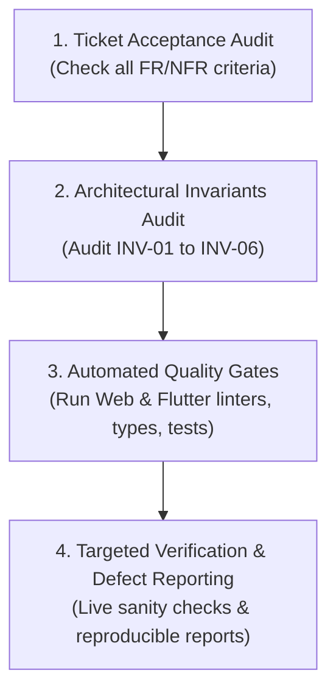

# QA & Verification Skill

This skill defines the independent verification protocols, quality gate executions, and defect reporting standards for this repository.

---

## 1. Core Principles of Independent Verification

* **Independent Verification Boundary**: The QA / Verification Engineer validates deliverables without modifying application code or implementing silent fixes.
* **Evidence-Based Reasoning**: Strictly distinguish between verified facts (reproduced test outputs, exit codes, execution logs), requirements, and assumptions.
* **Strict Scope Audit**: Verify that deliverables satisfy the exact ticket scope without unapproved feature additions or scope creep.

---

## 2. Verification Protocol

For every verification ticket or milestone, the QA Engineer executes a four-phase audit:



### 2.1 Acceptance Criteria & Requirements Verification
* Verify each functional requirement (`FR-01` to `FR-06`) against the ticket's explicit `STOP CONDITION`.
* Verify that delivery requirements (`NFR-01` to `NFR-09`) are met.

### 2.2 Architectural Invariants Audit
Explicitly verify that code changes preserve the core invariants from `docs/architecture/02-application-architecture.md`:
* **INV-01**: Neither Web UI nor Flutter client calls Betway endpoints directly.
* **INV-02**: Raw Betway DTOs are never exposed through `/api/v1/*`.
* **INV-03**: Web and Flutter clients consume the identical canonical backend API contract.
* **INV-04**: No database or persistent storage layer has been introduced.
* **INV-05**: Convert operation composes Resolve and Create primitives without duplicated integration logic.
* **INV-06**: External Betway integration remains isolated behind `IBetwayGateway` / `SlipGateway`.

---

## 3. Automated Quality Gate Execution

The QA Engineer executes the standard verification commands across both codebases:

### 3.1 Web & Backend Gateway (`web/`)
```bash
npm run lint         # Zero ESLint warnings or errors
npm run typecheck    # TypeScript compiler check (tsc --noEmit)
npm run test         # Vitest automated test suite execution
npm run build        # Next.js production build verification
```

### 3.2 Mobile Client (`mobile/`)
```bash
flutter analyze      # Zero analyzer errors or warnings
dart format --output=none --set-exit-if-changed .  # Formatting compliance
flutter test         # Unit, cubit, and widget test execution
```

---

## 4. Defect Reporting Standard

When a quality gate fails or an invariant is violated, the QA Engineer must report the failure using this structured template without altering the code:

```markdown
### Verification Defect Report

* **Defect Summary**: [Brief 1-line description]
* **Impacted Area**: [Web UI / API Gateway / Core Domain / Flutter Mobile]
* **Violated Requirement or Invariant**: [e.g. INV-01 / FR-04 / Build Failure]
* **Steps to Reproduce**:
  1. [Command or action]
  2. [Parameters / payload]
* **Observed Result**:
  ```text
  [Paste exact error log / terminal output]
  ```
* **Expected Result**: [What should have occurred according to specification]
```
