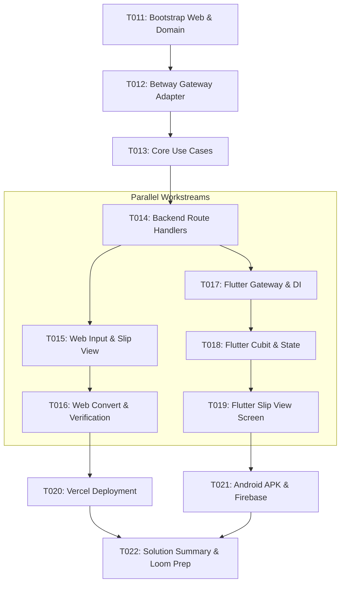

# Ticket Backlog & Work Tracking

This directory contains the repository-native ticket registry for the Betway Nigeria Booking Code project.

---

## Directory Structure

* **`backlog/`**: Tickets in `READY` or `DRAFT` state awaiting kickoff.
* **`active/`**: Tickets currently in `IN_PROGRESS`, `IMPLEMENTED`, `REVIEW`, `QA`, or `CHANGES_REQUIRED`.
* **`done/`**: Completed tickets that have satisfied all criteria in the [Definition of Done](../docs/process/development-workflow.md#5-definition-of-done-dod).

---

## Initial Implementation Backlog Index



| Ticket ID | Title | Status | Owner | Depends On | Short Objective |
| :--- | :--- | :--- | :--- | :--- | :--- |
| [`T011`](done/T011-bootstrap-web-and-core-domain.md) | Bootstrap Web Workspace & Core Domain | `DONE` | Full-Stack TypeScript Engineer | *None* | Init Next.js workspace, strict config, domain models (`BetSlip`, `BetSelection`), and `AppError`. |
| [`T012`](done/T012-implement-betway-gateway.md) | Implement Betway Gateway & Fixture Tests | `DONE` | Full-Stack TypeScript Engineer | `T011` | Implement `IBetwayGateway`, `BetwayHttpGateway`, timeouts, fallback routing, and mock tests. |
| [`T013`](done/T013-implement-application-use-cases.md) | Implement Application Use Cases | `DONE` | Full-Stack TypeScript Engineer | `T012` | Implement `Resolve`, `Create`, and `Convert` composition with 100% unit test coverage. |
| [`T014`](done/T014-implement-backend-api-routes.md) | Implement Backend API Route Handlers | `DONE` | Full-Stack TypeScript Engineer | `T013` | Implement `/api/v1/resolve`, `create`, `convert`, `health` with Zod validation and CORS. |
| [`T015`](done/T015-implement-web-input-and-slip-view.md) | Implement Web UI: Input & Slip View | `DONE` | Full-Stack TypeScript Engineer | `T014` | Build Next.js React UI components for entering codes, decoding, and rendering `BetSlipCard`. |
| [`T016`](done/T016-implement-web-conversion-and-verification.md) | Implement Web UI: Convert & Verification | `DONE` | Full-Stack TypeScript Engineer | `T015` | Build 1-click Convert action bar, code comparison badges, and Loom verification modal. |
| [`T017`](done/T017-bootstrap-flutter-gateway-and-di.md) | Bootstrap Flutter Gateway & DI | `DONE` | Flutter Engineer | `T014` | Init Flutter app, configure Dio + Retrofit, define `SlipGateway`, and wire `GetIt` DI. |
| [`T018`](done/T018-implement-flutter-cubit-and-state.md) | Implement Flutter Cubit & State | `DONE` | Flutter Engineer | `T017` | Implement `SlipCubit` and `SlipState` with `bloc_test` unit coverage against mocked gateway. |
| [`T019`](done/T019-implement-flutter-slip-viewer-screen.md) | Implement Flutter Slip Viewer Screen | `DONE` | Flutter Engineer | `T018` | Build `SlipViewerScreen` and decomposed widgets with widget tests covering all states. |
| [`T020`](done/T020-configure-vercel-deployment.md) | Configure Vercel Public Deployment | `DONE` | Full-Stack TypeScript Engineer | `T016` | Deploy `web/` to Vercel Hobby Tier and verify public live HTTPS endpoints. |
| [`T021`](done/T021-build-android-apk-and-firebase-distribution.md) | Build Android APK & Complete Firebase App Distribution Upload | `DONE` | Flutter Engineer | `T019`, `T020` | Build release APK, upload to Firebase App Distribution, and author iOS distribution note. |
| [`T022`](done/T022-author-solution-summary-and-loom-prep.md) | Author Solution Summary & Loom Prep | `DONE` | Project / Delivery Manager | `T020`, `T021` | Author `docs/08-solution-summary.md` and `docs/09-loom-walkthrough-outline.md`, and conduct final audit. |

---

## Ticket Lifecycle & Multi-Agent Execution

```text
DRAFT ──► READY ──► IN_PROGRESS ──► IMPLEMENTED ──► REVIEW ──► QA ──► DONE
                         ▲                                │     │
                         │                                │     │
                         └── CHANGES_REQUIRED ◄───────────┴─────┘
```

Every implementation ticket is executed via the 5-phase multi-agent orchestration pipeline:
```text
Execute <Ticket-ID> using the repository multi-agent delivery workflow.
```

For complete workflow rules, subagent isolation contracts, handoffs, and branch conventions, consult [`docs/process/development-workflow.md`](../docs/process/development-workflow.md).
